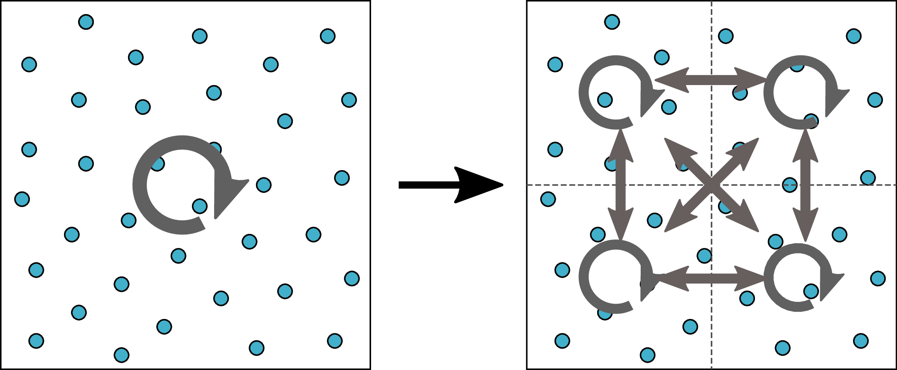

.. _GettingStarted:

Heirarchical Cell Decomposition
=================================

Most SPH codes rely on spatial trees to decompose the simulation space. This decomposition makes neighbour-finding simple, at the cost of computational efficiency. Neighbour-finding using the tree-based approach has an average computational cost of ~O(logN) and has a worst case behaviour of ~O(N\ :sup:`2/3`\), both cases grow with the total number of particles N. SWIFT's neighbour-finding algorithm however, has a constant scaling of ~O(1) per particle. This results from the way SWIFT decomposes its domain.

The space is divided up into a grid of rectangular cells with an edge length that is greater than or equal to the maximum smoothing of any particle in the simulation, h\ :sub:`max`\  (See :ref:`cell_decomp`). 

.. _cell_decomp:
.. figure:: InitialDecomp.png
   :scale: 40 %
   :align: center
   :figclass: align-center

   Figure 1: 2D Cell Decomposition

In this initial decomposition if a particle p\ :sub:`j`\  is within range of particle p\ :sub:`i`\, both will either be in the same cell (self-interaction) or in neighbouring cells (pair-interaction). Each cell then only has to compute its self-interactions and pair-interactions for each of its particles.   

The best case scenario is when each cell only contains particles that have a smoothing length equal to the cell edge length and even then, for any given particle p\ :sub:`i`\  it will only interact with 16% of the total number of particles in the same cell and surrounding neighbours. This percentage decreases if the cell contains particles whose smoothing length is less than the cell edge length. Therefore the cell decomposition needs to be refined recursively by bisecting a cell along each dimension if the following conditions are met:

1) The cell contains more than a minimum number of particles

2) The smoothing length of a reasonable number of particles within a cell is less than half the cell's edge length

.. _split_cell:

   Figure 2: Refined Cell Decomposition

Once a cell has been split its self-interactions can be decomposed into self-interactions of its sub-cells and corresponding pair interactions (See :ref:`split_cell`). If a pair of split cells share a boundary with each other and all particles in both cells have a smoothing length less than the cell edge length, then their pair-interactions can also be split up into pair-interactions of the sub-cells spanning the boundary (See :ref:`split_pair`).

.. _split_pair:
.. figure:: SplitPair.png
   :scale: 40 %
   :align: center
   :figclass: align-center

   Figure 3: Split Cell Pair Interactions

When the cells' particle interactions are split up between self-interactions and pair-interactions, any two particles who are within range of each other will either share a cell for which a cell self-interaction is defined or they will be located in neighbouring cells which share a cell pair-interaction. Therefore to determine whether particles are within range of each other it is sufficient to traverse the list of self-interactions and pair-interactions and compute the interactions therein.  

.. toctree::
   :maxdepth: 1
