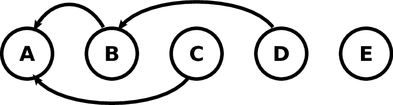

.. _GettingStarted:

Task Based Parallelism
=================================

One of biggest problems faced by many applications when running on a shared memory system is *load imbalance*, this occurs when the work load is not evenly distributed across the cores. The most well known paradigm for handling this type of parallel architecture is OpenMP, in which the programmer applies annotations to the code to indicate to the compiler which sections should be executed in parallel. If a ``for`` loop has been identified as a parallel section, the iterations of the loop are split between available threads, each executing on a single core. Once all threads have terminated the program becomes serial again and only executes on single thread, this technique is known as branch-and-bound parallelism, shown in :ref:`branch_and_bound`. Unfortunately, this implementation generally leads to low performance and bad scaling as you increase the number of cores. 

.. _branch_and_bound:
.. figure:: OMPScaling.png
   :scale: 40 %
   :align: center
   :figclass: align-center

   Figure 1: Branch-and-bound parallelism

Another disadvantage with this form of shared-memory parallelism is that there is no implicit handling of concurrency issues between threads. *Race conditions* can occur when two threads attempt to modify the same data simultaneously, unless explicit *critical* regions are defined which prevent more than one thread executing the same code at the same time. These regions degrade parallel performance even further.

A better way to exploit shared memory systems is to use an approach called *task-based parallelism*. This method describes the entire computation in a way that is more inherently parallelisable. The simulation is divided up into a set of computational tasks which are **dynamically** allocated to a number of processors. In order to ensure that the tasks are executed in the correct order and to avoid *race conditions*, *dependencies* between tasks are identified and strictly enforced by a task scheduler. A Directed Acyclic Graph (DAG) illustrates how a set of computational tasks link together via dependencies. Processors can traverse the graph in topological order, selecting and executing tasks that have no unresolved dependencies or waiting until tasks become available. This selection process continues for all processors until all tasks have been completed. An example of a DAG can be seen in :ref:`DAG`, the figure represents tasks as circles, labelled A-E, and dependencies as arrows. Tasks B and C both depend on A, and D depends on B, whereas A and E are independent tasks. Therefore on a shared memory system, tasks A and E could be executed first. Once task A is finished, tasks B and C become available for execution as their dependencies to A have been resolved. Finally, task D can be executed after task B has completed. 

.. _DAG:

   Figure 2: Tasks and Dependencies

The main advantages of using this approach are as follows:

* The order in which the tasks are processed is completely dynamic and adapts automatically to load imbalances.
* If the dependencies and conflicts are specified correctly, there is no need for expensive explicit locking, synchronisation or atomic operations, found in OpenMP to deal with most concurrency problems.
* Each task has exclusive access to the data it is working on, thus improving cache locality and efficiency.  

SWIFT modifies the task-based approach by introducing the concept of *conflicts* between tasks. Conflicts occur when two tasks operate on the same data, but the order in which the operations occur does not matter. :ref:`task_conflicts` illustrates tasks with conflicts, where there is a conflict between tasks B and C, and tasks D and E. In a parallel setup, once task A has finished executing, if one processor selects task B, then no other processor is allowed to execute task C until task B has completed, or vice versa. Without this modification, other task-based models used dependencies to model conflicts between tasks, which introduces an artificial ordering between tasks and imposes unnecessary constraints on the task scheduler.  

.. _task_conflicts:
.. figure:: TasksExampleConflicts.png
   :scale: 40 %
   :align: center
   :figclass: align-center

   Figure 3: Tasks and Conflicts

.. toctree::
   :maxdepth: 1
