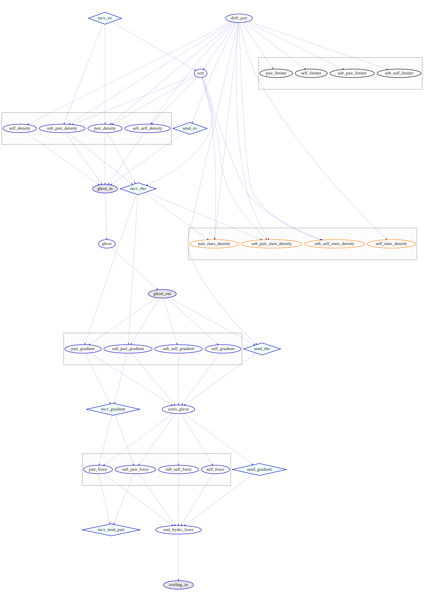

.. Hydrodynamics Schemes
   Josh Borrow 4th April 2018

.. _hydro:
   
Hydrodynamics Schemes
=====================

This section of the documentation includes information on the hydrodynamics
schemes available in SWIFT, as well as how to implement your own.

Depending on the scheme used, the algorithm will need either 2
(e.g. GADGET-2) or 3 (e.g. GIZMO and SPHENIX) interaction loops.
Here we show the task dependencies for the hydrodynamics assuming 3 loops.
In case the case of a 2 loop scheme, SWIFT removes the gradient loop and the extra ghost.

    This figure shows the task dependencies for the hydrodynamics assuming a scheme with the gradient loop.
    The first tasks to be executed are at top the (without any incoming links) and then in the order of the links
    until the last tasks without any outgoing links.
    For the hydrodynamics tasks (in blue), the rectangles represent (from top to bottom) the density, gradient and force loops.
    As this graph was created manually, the task dependencies might not reflect a real run depending on the physics simulated.
    This was done with SWIFT v0.9.0.

.. toctree::
   :maxdepth: 2
   :caption: Contents:

   traditional_sph
   minimal_sph
   planetary_sph
   hopkins_sph
   anarchy_sph
   sphenix_sph
   gasoline_sph
   phantom_sph
   adaptive_softening
   gizmo
   adding_your_own

