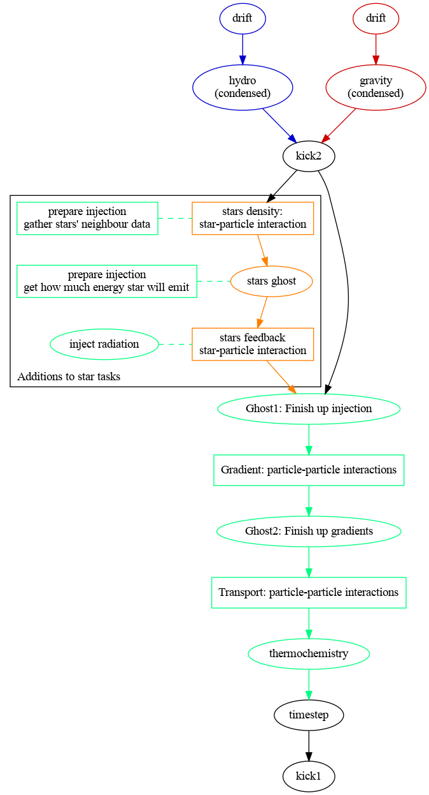
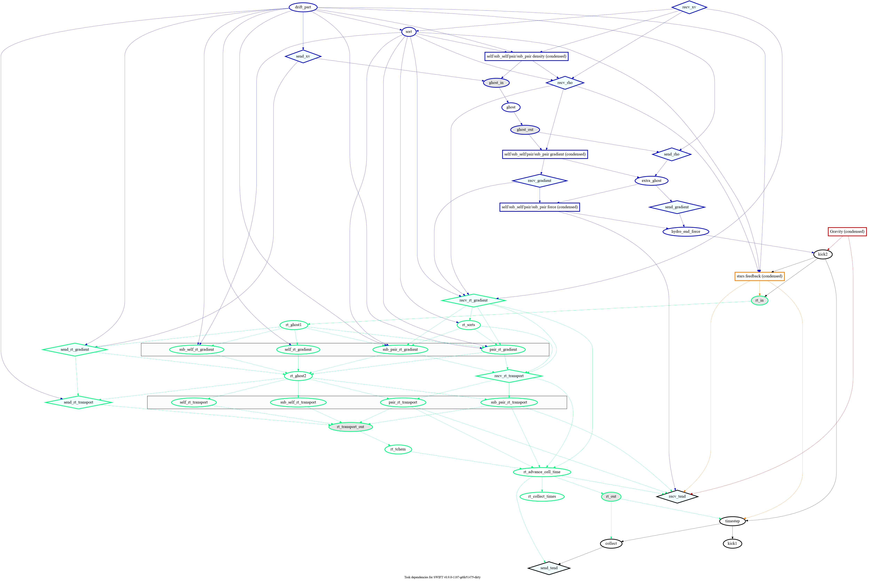
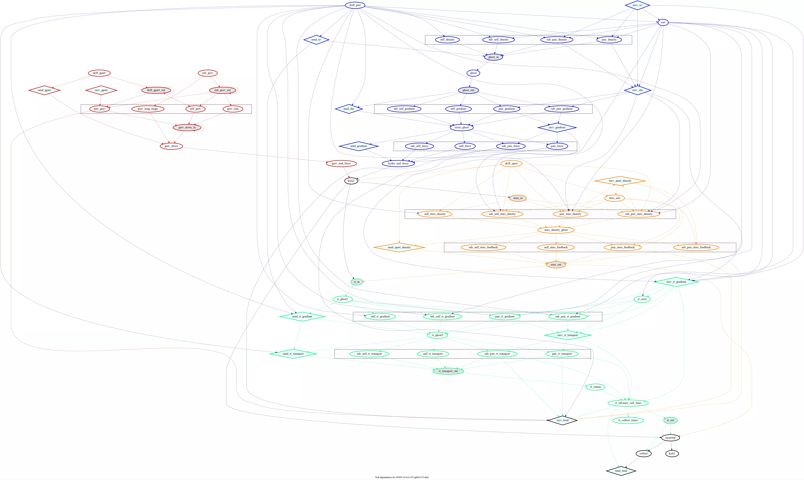

.. RT developer notes
    Mladen Ivkovic 07.2022

.. _rt_dev:
   
Notes for Developers
========================


.. _rt_workflow:

The Radiative Transfer Workflow
~~~~~~~~~~~~~~~~~~~~~~~~~~~~~~~~~

This section is intended to give a superficial overview on the general workflow 
that the RT tasks are going through. It should be sufficient to give you a general
idea of how things work, and allow you to plan and implement your own RT scheme
into SWIFT.

For a more complete documentation on the tasking system used for RT, please refer
to the :ref:`subsequent section <rt_task_system>`.



    This figure shows the general RT workflow in SWIFT.
    The green nodes are the ones related to the RT.


- There are some additions to star tasks: 

  1)    During the star density loop, we gather additional neighbour information
        that are required for the star-gas interaction.

  2)    In the star ghost tasks, stars compute how much radiation they will 
        inject in the surrounding gas. The radiation injection scheme follows 
        the philosophy of the stellar feedback, and only stars that are 
        currently active will inject radiation into neighbouring gas particles, 
        regardless of whether the gas particle is currently active (as opposed 
        to active gas particles "pulling" radiation from possibly inactive 
        stars). So the each star needs to compute how much radiation it will 
        emit during its current time step.

  3)    During the stellar feedback interaction loop, the stars inject radiation
        onto neighbouring gas particles.

- ``Ghost1`` tasks operate on individual particles, and are intended to finish up
  any leftover work from the injection.

- ``Gradient`` tasks are particle-particle interaction tasks, intended for 
  particles to gather data from its own neighbours, e.g. so we can estimate the 
  current local gradients.  This is an interaction of "type 1", meaning that any 
  particle will only interact with neighbours which are whithin its own compact 
  support radius.

- ``Ghost2`` tasks operate on individual particles, and are intended to finish 
  up any leftover work from the "gradients".

- ``Transport`` tasks are particle-particle interaction tasks, intended to 
  propagate the radiation. This is an interaction of "type 2", meaning that any 
  particle will interact with any neighbours whithin either particles' compact 
  support radius.

- ``thermochemistry`` tasks operate on individual particles, and are intended
  to solve the thermochemistry equations.


.. _rt_task_system:

Current Task System
~~~~~~~~~~~~~~~~~~~~

Some RT tasks featured in the full task graphs below, like the 
``rt_advance_cell_time``, ``rt_collect_times``, and ``rt_sorts``, have not been 
mentioned in the previous section. They are necessary for internal machinations 
of the RT subcycling scheme, and do not affect the RT scheme itself. If you are
implementing a new RT scheme into SWIFT, you should not need to touch those
tasks. For more documentation on them, please refer to the :ref:`subsequent
section <rt_subcycling_documentation>`.




    This figure shows the task dependencies for the radiative transfer scheme.
    Some tasks with little or no relevance to the RT scheme have been simplified
    and condensed for clarity.
    This was done with SWIFT v0.9.0.




    This figure shows the full task dependencies for the radiative transfer scheme
    with self-gravity.
    This was done with SWIFT v0.9.0.


.. _rt_subcycling_documentation:

Notes on Subcycling
~~~~~~~~~~~~~~~~~~~~~

Note: This section is directed towards developers and maintainers, not
necessarily towards users.

How it works
`````````````````

A subcycle is basically a SWFIT time step where only radiative transfer is being
run.

After a normal SWIFT time step (i.e. after a call to ``engine_launch()`` and the
global collection and communication) is complete, the starting time of the
following global time step is known. We also collect the current minimal RT time 
step size, which allows us to determine how many sub-cycles we need to complete
before the next normal SWIFT time step is launched. Particles are not drifted 
during a subcycle, and the propagation velocity (aka the speed of light) is 
taken to be constant, so the number of subcycles is fixed at the end of a normal 
step. For each subcycle, we then unskip the RT tasks, and make a new call to
``engine_launch()``.

For the time integration to work correctly, the time integration variables of
particles like the time-bins are kept independently from the hydro ones. The same
goes for the respective quantities of cells, like the next integer end time of
the cell, or the minimal RT time step size in the cell. Furthermore, the global
time variables that are stored in the engine (e.g. current integer time, current
max active bin...) have a copy that is being kept up-to-date outside of normal
SWIFT steps in the same manner the non-RT variables are being updated each
normal step. The RT subcycling scheme never touches or changes any global time
integration related variable.

Since the time stepping variables of particles and cells are taken to be
constant during subcycles (because there are no drifts, constant speed of
light), the ``timestep`` tasks are not being run during a sub-cycle. This
effectively means that the particle time bins can only be changed in a normal
step when the particle is also hydro-active. Furthermore, there are no MPI 
communications after the tasks have finished executing to update any global 
times etc. for the same reason. There are some functionalities of the
``timestep`` and the ``collect`` tasks which are still necessary though:

- The ``timestep`` task also updates the cell's next integer end time after it
  has been determined during the task. During a subcycle, the next end time is
  simply the current time plus the minimal time step size of the cell, but we
  need a task to actually update the cell at the end of each subcycle. The
  ``rt_advance_cell_time`` task does exactly that, and in that sense does the
  ``timestep`` task's job during subcycles.

- The ``collect`` task propagates sub-cell data like the minimal end time or the
  RT time step size from the super level to the top level. This functionality is
  replaced with the ``rt_collect_times`` tasks during subcycles. Note that the
  ``rt_collect_times`` tasks aren't being activated during normal steps, as the
  ``collect`` tasks already to the job just fine.

Something special about the ``rt_advance_cell_time`` tasks is that they are
also created and run on foreign cells. During a subcycle, the ``tend`` tasks
don't run and don't update the cell time variables from the original cell, so
during the subsequent unskipping, the data will be wrong, leading to all sorts
of trouble. We can do that on foreign cells during sub-cycles because all the
cell's time step sizes stay fixed between two reguler SWIFT steps, and hence
the number of sub-cycles all the sub-cycles' end times are predictable.


RT Sorts
````````````````

The sorting of particles required for pair-type interaction tasks requires some
special attention. The issues arise because a subcycle step of a cell can
coincide with the main step of another cell. To illustrate, suppose we have two
cells, ``A`` and ``B``. Let cell ``A`` have a hydro time step of size 4, and 
cell ``B`` a hydro time step of size 8. Let both cells do 2 RT subcycles per
hydro step each. In the graph below, an ``X`` represents when a cell will be
updated:

.. code::

   Cell A
     Hydro active:    X               X               X               X               X       
     RT active:       X       X       X       X       X       X       X       X       X       X

   Cell B
     Hydro active:    X                               X                               X
     RT active:       X               X               X               X               X       
    
    
    ------------------|---|---|---|---|---|---|---|---|---|---|---|---|---|---|---|---|---|---|
    t                 0   1   2   3   4   5   6   7   8   9  10  11  12  13  14  15  16  17  18


Note that e.g. at ``t`` = 4, cell ``B`` is only RT active, while cell ``A`` is
also hydro active. It being hydro active means that we will have a SWIFT main
step at that time.

Now suppose cell cells ``A`` and ``B`` are neighbouring cells that undergo hydro
interactions, but are on different MPI ranks. For the hydro interactions in the
normal SWIFT step at ``t`` = 4, cell ``B`` will be sent over to the rank of 
cell ``A``. Once it was received, it will be sorted, because after being 
received, the ``recv_xv`` task resets the arrived cell's sort tasks, and a hydro 
sort is activated. This is the default hydrodynamics workflow.


Complications however arise when several conditions coincide:

- a foreign cell has been drifted on its "home" domain due to some reason other 
  than hydro, e.g. for gravity or for stellar feedback. 
- the foreign cell and all of its neighbours are not hydro active at the current
  main step, so no ``recv_xv`` task has been run on the local rank, no ``sort``
  task has been run, and the sorting flags have not been reset for the cell.
- the foreign cell is involved in an RT interaction that coincides with the 
  current main step, i.e. the cell or one of its neighbours is RT active during
  a main step. (E.g. like cell ``A`` at ``t`` = 2 in the graph above.)

If these conditions are met, the cell will undergo an interaction while
unsorted. Obviously that's a no-no.

To solve this issue, a new task has been added, named ``rt_sorts``. It is only
required for foreign cells, and only during normal steps (as we don't drift
during subcycles, there won't be any reason to re-sort.) It's executed after the
first RT related ``recv``, in this case the ``recv_rt_gradient``.

In order to minimize unnecessary work, three new cell flags concerning the RT
sorts have been added:

- ``cell_flag_do_rt_sub_sort``: tracks whether we need an RT sub sort, which is 
  equivalent to the ``cell_flag_do_sub_sort`` flag for hydro. We can't use the 
  hydro flag though because the hydro flag is also used to early-exit walking up 
  the cell hierarchy when activating hydro subcell sorts. So we need an
  independent flag here.

- ``cell_flag_do_rt_sort``: tracks whether the call to the 
  ``runner_do_hydro_sort()`` function requested by an RT sort. (Both the (hydro) 
  ``sort`` and the ``rt_sort`` tasks call the same function.) It is used to allow 
  the cell to be "undrifted to the current time" instead of crashing. (When an RT 
  subcycle coincides with a main step, the particles won't necessarily be drifted 
  to the current time as there is no need to drift them for RT only. So we allow
  ``runner_do_hydro_sort()`` to skip this check in this case.)

- ``cell_flag_skip_rt_sort``: Tracks whether a regular hydro sort has been
  activated for this cell. If it has, then there is no need to run an RT sort as
  well, and we skip it.

