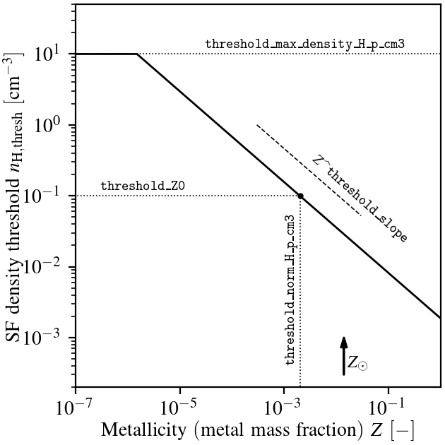
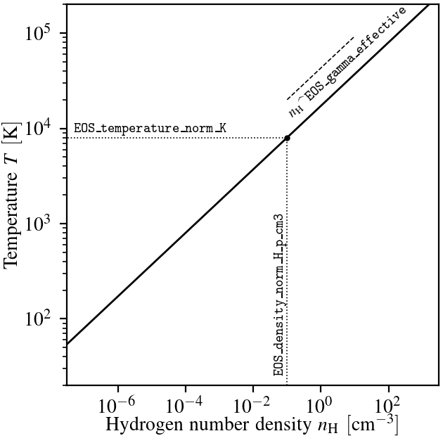

.. EAGLE sub-grid model
   Matthieu Schaller, 20th December 2018

EAGLE model
===========

This section of the documentation gives a brief description of the
different components of the EAGLE sub-grid model. We mostly focus on
the parameters and values output in the snapshots.

.. _EAGLE_entropy_floors:

Gas entropy floors
~~~~~~~~~~~~~~~~~~

The gas particles in the EAGLE model are prevented from cooling below a
certain temperature. The temperature limit depends on the density of the
particles. Two floors are used in conjunction. Both are implemented as
polytropic "equations of states":math:`P = P_c
\left(\rho/\rho_c\right)^\gamma` (all done in physical coordinates), with
the constants derived from the user input given in terms of temperature and
Hydrogen number density. The code computing the entropy floor
is located in the directory ``src/entropy_floor/EAGLE/`` and the floor
is applied in the drift and kick operations of the hydro scheme. It is
also used in some of the other subgrid schemes.

The first limit, labeled as ``Cool``, is typically used to prevent
low-density high-metallicity particles to cool below the warm phase because
of over-cooling induced by the absence of metal diffusion. This limit plays
only a small role in practice. The second limit, labeled as ``Jeans``, is
used to prevent the fragmentation of high-density gas into clumps that
cannot be resolved by the coupled hydro+gravity solver. The two limits are
sketched on the following figure.

.. figure:: EAGLE_entropy_floor.svg
    :width: 400px
    :align: center
    :figclass: align-center
    :alt: Phase-space diagram displaying the two entropy floors used
	  in the EAGLE model.

    Temperature-density plane with the two entropy floors used in the EAGLE
    model indicated by the black lines. Gas particles are not allowed to be
    below either of these two floors; they are hence forbidden to enter the
    grey-shaded region. The floors are specified by the position in the
    plane of the starting point of each line (black circle) and their slope
    (dashed lines). The parameter names governing the behaviour of the
    floors are indicated on the figure. Note that unlike what is shown on
    the figure for clarity reasons, typical values for EAGLE runs place
    both anchors at the same temperature.

An additional over-density criterion above the mean baryonic density is
applied to prevent gas not collapsed into structures from being
affected. To be precise, this criterion demands that the floor is applied
only if :math:`\rho_{\rm com} > \Delta_{\rm floor}\bar{\rho_b} =
\Delta_{\rm floor} \Omega_b \rho_{\rm crit,0}`, with :math:`\Delta_{\rm
floor}` specified by the user, :math:`\rho_{\rm crit,0} = 3H_0/8\pi G` the
critical density at redshift zero [#f1]_, and :math:`\rho_{\rm com}` the
gas co-moving density. Typical values for :math:`\Delta_{\rm floor}` are of
order 10.

The model is governed by 4 parameters for each of the two limits. These are
given in the ``EAGLEEntropyFloor`` section of the YAML file. The parameters
are the Hydrogen number density (in :math:`cm^{-3}`) and temperature (in
:math:`K`) of the anchor point of each floor as well as the power-law slope
of each floor and the minimal over-density required to apply the
limit. Note that, even though the anchor points are given in terms of
temperatures, the slopes are expressed using a power-law in terms of
entropy and *not* in terms of temperature. For a slope of :math:`\gamma` in
the parameter file, the temperature as a function of density will be
limited to be above a power-law with slope :math:`\gamma - 1` (as shown on
the figure above). To simplify things, all constants are converted
to the internal system of units upon reading the parameter file.

For a normal EAGLE run, that section of the parameter file reads:

.. code:: YAML

  EAGLEEntropyFloor:
     Jeans_density_threshold_H_p_cm3: 0.1       # Physical density above which the EAGLE Jeans limiter entropy floor kicks in, expressed in Hydrogen atoms per cm^3.
     Jeans_over_density_threshold:    10.       # Overdensity above which the EAGLE Jeans limiter entropy floor can kick in.
     Jeans_temperature_norm_K:        8000      # Temperature of the EAGLE Jeans limiter entropy floor at the density threshold, expressed in Kelvin.
     Jeans_gamma_effective:           1.3333333 # Slope of the EAGLE Jeans limiter entropy floor
     Cool_density_threshold_H_p_cm3:  1e-5      # Physical density above which the EAGLE Cool limiter entropy floor kicks in, expressed in Hydrogen atoms per cm^3.
     Cool_over_density_threshold:     10.       # Overdensity above which the EAGLE Cool limiter entropy floor can kick in.
     Cool_temperature_norm_K:         8000      # Temperature of the EAGLE Cool limiter entropy floor at the density threshold, expressed in Kelvin.
     Cool_gamma_effective:            1.        # Slope of the EAGLE Cool limiter entropy floor

SWIFT will convert the temperature normalisations and Hydrogen number
density thresholds into internal energies and densities respectively
assuming a neutral gas with primordial abundance pattern. This implies
that the floor may not be exactly at the position given in the YAML
file if the gas has different properties. This is especially the case
for the temperature limit which will often be lower than the imposed
floor by a factor :math:`\frac{\mu_{\rm neutral}}{\mu_{ionised}}
\approx \frac{1.22}{0.59} \approx 2` due to the different ionisation
states of the gas.

Recall that we additionally impose an absolute minimum temperature at all
densities with a value provided in the :ref:`Parameters_SPH` section of the parameter
file. This minimal temperature is typically set to 100 Kelvin.

Note that the model only makes sense if the ``Cool`` threshold is at a lower
density than the ``Jeans`` threshold.

.. _EAGLE_chemical_tracers:

Chemical tracers
~~~~~~~~~~~~~~~~

The gas particles in the EAGLE model carry metal abundance information in the
form of metal mass fractions. We follow explicitly 9 of the 11 elements that
`Wiersma et al. (2009)b <http://adsabs.harvard.edu/abs/2009MNRAS.399..574W>`_
traced in their chemical enrichment model. These are: `H`, `He`, `C`, `N`, `O`,
`Ne`, `Mg`, `Si` and `Fe` [#f2]_. We additionally follow the total metal mass fraction
(i.e. absolute metallicity) `Z`. This is typically larger than the sum of the 7
metals that are individually traced since this will also contain the
contribution of all the elements that are not individually followed.  We note
that all of definitions are independent of any definition of solar the solar
metallicity :math:`Z_\odot` or of any solar abundance pattern.

As part of the diagnostics, we additionally trace the elements coming
from the different stellar evolution channels. We store for each
particle the total mass coming from all the SNIa that enriched that
particle and the metal mass fraction from SNIa. This is the fraction
of the *total* gas mass that is in the form of metals originating from
SNIa stars. By construction this fraction will be smaller than the
total metal mass fraction. The same tracers exist for the SNII and AGB
channels. Finally, we also compute the iron gas fraction from
SNIa. This it the fraction of the *total* gas mass that is made of
iron originating from SNIa explosions. 

We finally also compute the smoothed versions of the individual
element mass fractions, of the total metal mass fractions, and of the
iron gas fraction from SNIa.

The chemistry module in ``src/chemistry/EAGLE/`` includes all the arrays
that are added to the particles and the functions used to compute the
smoothed elements.

When a star is formed (see the section :ref:`EAGLE_star_formation` below), it
inherits all the chemical tracers of its parent gas particle.

In the snapshots, we output for each gas and star particle:

+---------------------------------------+-------------------------------------+-----------+-----------------------------+
| Name                                  | Description                         | Units     | Comments                    |
+=======================================+=====================================+===========+=============================+
| ``ElementMassFractions``              | | Fraction of the gas/star mass     | [-]       | | Array of length           |
|                                       | | in the different elements         |           | | 9 for each particle       |
+---------------------------------------+-------------------------------------+-----------+-----------------------------+
| ``SmoothedElementMassFractions``      | | Fraction of the gas/star mass     | [-]       | | Array of length           |
|                                       | | in the different elements         |           | | 9 for each particle       |
|                                       | | smoothed over SPH neighbours      |           |                             |
+---------------------------------------+-------------------------------------+-----------+-----------------------------+
| ``MetalMassFractions``                | | Fraction of the gas/star mass     | [-]       |                             |
|                                       | | in *all* metals                   |           |                             |
+---------------------------------------+-------------------------------------+-----------+-----------------------------+
| ``SmoothedMetalMassFractions``        | | Fraction of the gas/star mass     | [-]       |                             |
|                                       | | in *all* metals                   |           |                             |
|                                       | | smoothed over SPH neighbours      |           |                             |
+---------------------------------------+-------------------------------------+-----------+-----------------------------+
| ``MassesFromSNIa``                    | | Total mass of the gas/star        | [U_M]     |                             |
|                                       | | that was produced by enrichment   |           |                             |
|                                       | | from SNIa stars                   |           |                             |
+---------------------------------------+-------------------------------------+-----------+-----------------------------+
| ``MetalMassFractionsFromSNIa``        | | Fraction of the *total* gas/star  | [-]       |                             |
|                                       | | mass that is in metals produced   |           |                             |
|                                       | | by enrichment from SNIa stars     |           |                             |
+---------------------------------------+-------------------------------------+-----------+-----------------------------+
| ``MassesFromAGB``                     | | Total mass of the gas/star        | [U_M]     |                             |
|                                       | | that was produced by enrichment   |           |                             |
|                                       | | from AGB stars                    |           |                             |
+---------------------------------------+-------------------------------------+-----------+-----------------------------+
| ``MetalMassFractionsFromAGB``         | | Fraction of the *total* gas/star  | [-]       |                             |
|                                       | | mass that is in metals produced   |           |                             |
|                                       | | by enrichment from AGB star       |           |                             |
+---------------------------------------+-------------------------------------+-----------+-----------------------------+
| ``MassesFromSNII``                    | | Total mass of the gas/star        | [U_M]     |                             |
|                                       | | that was produced by enrichment   |           |                             |
|                                       | | from SNII stars                   |           |                             |
+---------------------------------------+-------------------------------------+-----------+-----------------------------+
| ``MetalMassFractionsFromSNII``        | | Fraction of the gas/star mass     | [-]       |                             |
|                                       | | that is in metals produced by     |           |                             |
|                                       | | enrichment from SNII stars        |           |                             |
+---------------------------------------+-------------------------------------+-----------+-----------------------------+
| ``IronMassFractionsFromSNIa``         | | Fraction of the *total* gas/star  | [-]       |                             |
|                                       | | mass in *iron* produced produced  |           |                             |
|                                       | | by enrichment from SNIa stars     |           |                             |
+---------------------------------------+-------------------------------------+-----------+-----------------------------+
| ``SmoothedIronMassFractionsFromSNIa`` | | Fraction of the *total* gas/star  | [-]       |                             |
|                                       | | mass in *iron* produced produced  |           |                             |
|                                       | | by enrichment from SNIa stars     |           |                             |
|                                       | | smoothed over SPH neighbours      |           |                             |
+---------------------------------------+-------------------------------------+-----------+-----------------------------+

The stars will lose mass over their lifetime (up to ~45%). The fractions will
remain unchanged but if one is interested in computing an absolute metal mass
(say) for a star, the ``InitialMasses`` (see the section
:ref:`EAGLE_star_formation` below) of the star must be used.

The chemistry model only requires a small number of parameters to be specified
in the `EAGLEChemistry` section of the YAML file. These are the initial values
of the metallicity and element mass fractions. These are then applied at the
start of a simulation to *all* the gas and star particles. All 9 traced elements
have to be specified An example section, for primordial abundances (typical for
a cosmological run), is:

.. code:: YAML

   EAGLEChemistry:
     init_abundance_metal:        0.    # Mass fraction in *all* metals
     init_abundance_Hydrogen:     0.755 # Mass fraction in Hydrogen
     init_abundance_Helium:       0.245 # Mass fraction in Helium
     init_abundance_Carbon:       0.    # Mass fraction in Carbon
     init_abundance_Nitrogen:     0.    # Mass fraction in Nitrogen
     init_abundance_Oxygen:       0.    # Mass fraction in Oxygen
     init_abundance_Neon:         0.    # Mass fraction in Neon
     init_abundance_Magnesium:    0.    # Mass fraction in Magnesium
     init_abundance_Silicon:      0.    # Mass fraction in Silicon
     init_abundance_Iron:         0.    # Mass fraction in Iron

Whilst one would use the following values for solar abundances
(typical for an idealised low-redshift run):

.. code:: YAML

   EAGLEChemistry:
     init_abundance_metal:        0.014        # Mass fraction in *all* metals
     init_abundance_Hydrogen:     0.70649785   # Mass fraction in Hydrogen
     init_abundance_Helium:       0.28055534   # Mass fraction in Helium
     init_abundance_Carbon:       2.0665436e-3 # Mass fraction in Carbon
     init_abundance_Nitrogen:     8.3562563e-4 # Mass fraction in Nitrogen
     init_abundance_Oxygen:       5.4926244e-3 # Mass fraction in Oxygen
     init_abundance_Neon:         1.4144605e-3 # Mass fraction in Neon
     init_abundance_Magnesium:    5.907064e-4  # Mass fraction in Magnesium
     init_abundance_Silicon:      6.825874e-4  # Mass fraction in Silicon
     init_abundance_Iron:         1.1032152e-3 # Mass fraction in Iron

Note that the code will verify that the input values make broad sense. This
means that SWIFT checks on startup that:

 * :math:`Z_{\rm H}+Z_{\rm He}+Z_{\rm metals} \approx 1`
 * :math:`Z_{\rm C} + Z_{\rm N} + Z_{\rm O} + Z_{\rm Ne} + Z_{\rm Mg} + Z_{\rm Si} + Z_{\rm Fe} \lesssim Z_{\rm metals}`
 * :math:`Z_{\rm H} + Z_{\rm He} + Z_{\rm C} + Z_{\rm N} + Z_{\rm O} + Z_{\rm Ne} + Z_{\rm Mg} + Z_{\rm Si} + Z_{\rm Fe} \approx 1`

Individual element abundances for each particle can also be read
directly from the ICs. By default these are overwritten in the code by
the values read from the YAML file. However, users can set the
parameter ``init_abundance_metal`` to ``-1`` to make SWIFT ignore the
values provided in the parameter file:

.. code:: YAML

   EAGLEChemistry:
     init_abundance_metal:       -1     # Read the particles' metal mass fractions from the ICs.

The ICs must then contain values for these three fields (same as what
is written to the snapshots):

+----------------------------------+-------------------------------------+-----------+-----------------------------+
| Name                             | Description                         | Units     | Comments                    |
+==================================+=====================================+===========+=============================+
| ``ElementAbundance``             | | Fraction of the gas/star mass     | [-]       | | Array of length           |
|                                  | | in the different elements         |           | | 9 for each particle       |
+----------------------------------+-------------------------------------+-----------+-----------------------------+
| ``Metallicity``                  | | Fraction of the gas/star mass     | [-]       |                             |
|                                  | | in *all* metals                   |           |                             |
+----------------------------------+-------------------------------------+-----------+-----------------------------+
| ``IronMassFracFromSNIa``         | | Fraction of the *total* gas/star  | [-]       |                             |
|                                  | | mass in *iron* produced produced  |           |                             |
|                                  | | by enrichment from SNIa stars     |           |                             |
+----------------------------------+-------------------------------------+-----------+-----------------------------+

If these fields are absent, then a value of ``0`` will be used for all
of them, likely leading to issues in the way the code will run.

.. _EAGLE_cooling:
     
Gas cooling: Wiersma+2009a
~~~~~~~~~~~~~~~~~~~~~~~~~~

The gas cooling is based on the redshift-dependent tables of `Wiersma et
al. (2009)a <http://adsabs.harvard.edu/abs/2009MNRAS.393...99W>`_ that include
element-by-element cooling rates for the 11 elements (`H`, `He`, `C`, `N`, `O`,
`Ne`, `Mg`, `Si`, `S`, `Ca` and `Fe`) that dominate the total rates. The tables
assume that the gas is in ionization equilibrium with the cosmic microwave
background (CMB) as well as with the evolving X-ray and UV background from
galaxies and quasars described by the model of `Haardt & Madau (2001)
<http://adsabs.harvard.edu/abs/2001cghr.confE..64H>`_. Note that this model
ignores *local* sources of ionization, self-shielding and non-equilibrium
cooling/heating. The tables can be obtained from this `link
<http://virgodb.cosma.dur.ac.uk/swift-webstorage/CoolingTables/EAGLE/coolingtables.tar.gz>`_
which is a re-packaged version of the `original tables
<http://www.strw.leidenuniv.nl/WSS08/>`_. The code reading and interpolating the
table is located in the directory ``src/cooling/EAGLE/``.

The Wiersma tables containing the cooling rates as a function of redshift,
Hydrogen number density, Helium fraction (:math:`X_{He} / (X_{He} + X_{H})`) and
element abundance relative to the solar abundance pattern assumed by the tables
(see equation 4 in the original paper). As the particles do not carry the mass
fraction of `S` and `Ca`, we compute the contribution to the cooling rate of
these elements from the abundance of `Si`. More specifically, we assume that
their abundance by mass relative to the table's solar abundance pattern is the
same as the relative abundance of `Si` (i.e. :math:`[Ca/Si] = 0` and
:math:`[S/Si] = 0`). Users can optionally modify the ratios used for `S` and
`Ca`. Note that we use the *smoothed* abundances of elements for all calculations.

Above the redshift of Hydrogen re-ionization we use the extra table containing
net cooling rates for gas exposed to the CMB and a UV + X-ray background at
redshift nine truncated above 1 Rydberg. At the redshift or re-ionization, we
additionally inject a fixed user-defined amount of energy per unit mass to all
the gas particles.

In addition to the tables we inject extra energy from Helium II re-ionization
using a Gaussian model with a user-defined redshift for the centre, width and
total amount of energy injected per unit mass. Additional energy is also
injected instantaneously for Hydrogen re-ionisation to all particles (active and
inactive) to make sure the whole Universe reaches the expected temperature
quickly (i.e not just via the interaction with the now much stronger UV
background).

For non-cosmological run, we use the :math:`z = 0` table and the interpolation
along the redshift dimension then becomes a trivial operation.

The cooling itself is performed using an implicit scheme (see the theory
documents) which for small values of the cooling rates is solved explicitly. For
larger values we use a bisection scheme.  The cooling rate is added to the
calculated change in energy over time from the other dynamical equations. This
is different from other commonly used codes in the literature where the cooling
is done instantaneously.

We note that the EAGLE cooling model does not impose any restriction on the
particles' individual time-steps. The cooling takes place over the time span
given by the other conditions (e.g the Courant condition).

Finally, the cooling module also provides a function to compute the temperature
of a given gas particle based on its density, internal energy, abundances and
the current redshift. This temperature is the one used to compute the cooling
rate from the tables and similarly to the cooling rates, they assume that the
gas is in collisional equilibrium with the background radiation. The
temperatures are, in particular, computed every time a snapshot is written and
they are listed for every gas particle:

+---------------------+-------------------------------------+-----------+-------------------------------------+
| Name                | Description                         | Units     | Comments                            |
+=====================+=====================================+===========+=====================================+
| ``Temperatures``    | | Temperature of the gas as         | [U_T]     | | The calculation is performed      |
|                     | | computed from the tables.         |           | | using quantities at the last      |
|                     |                                     |           | | time-step the particle was active |
+---------------------+-------------------------------------+-----------+-------------------------------------+

Note that if one is running without cooling switched on at runtime, the
temperatures can be computed by passing the ``--temperature`` runtime flag (see
:ref:`cmdline-options`). Note that the tables then have to be available as in
the case with cooling switched on.

The cooling model is driven by a small number of parameter files in the
`EAGLECooling` section of the YAML file. These are the re-ionization parameters,
the path to the tables and optionally the modified abundances of `Ca`
and `S`. A valid section of the YAML file looks like:

.. code:: YAML

   EAGLECooling:
     dir_name:     /path/to/the/Wiersma/tables/directory # Absolute or relative path
     H_reion_z:            11.5      # Redshift of Hydrogen re-ionization
     H_reion_ev_p_H:        2.0      # Energy injected in eV per Hydrogen atom for Hydrogen re-ionization.
     He_reion_z_centre:     3.5      # Centre of the Gaussian used for Helium re-ionization
     He_reion_z_sigma:      0.5      # Width of the Gaussian used for Helium re-ionization
     He_reion_ev_p_H:       2.0      # Energy injected in eV per Hydrogen atom for Helium II re-ionization.

And the optional parameters are:

.. code:: YAML

   EAGLECooling:
     Ca_over_Si_in_solar:       1.0 # (Optional) Value of the Calcium mass abundance ratio to solar in units of the Silicon ratio to solar. Default value: 1.
     S_over_Si_in_solar:        1.0 # (Optional) Value of the Sulphur mass abundance ratio to solar in units of the Silicon ratio to solar. Default value: 1.

.. _EAGLE_tracers:
     
Particle tracers
~~~~~~~~~~~~~~~~

Over the course of the simulation, the gas particles record some information
about their evolution. These are updated for a given particle every time it is
active. The EAGLE tracers module is located in the directory
``src/tracers/EAGLE/``. 

In the EAGLE model, we trace the maximal temperature a particle has reached and
the time at which this happened. When a star is formed (see the section
:ref:`EAGLE_star_formation` below), it inherits all the tracer values of its parent
gas particle.  There are no parameters to the model but two values are added to
the snapshots for each gas and star particle:

+----------------------------------------+---------------------------------------+-----------+-----------------------------+
| Name                                   | Description                           | Units     | Comments                    |
+========================================+=======================================+===========+=============================+
| | ``MaximalTemperatures``              | | Maximal temperature reached by      | | [U_T]   |                             |
|                                        | | this particle.                      |           |                             |
+----------------------------------------+---------------------------------------+-----------+-----------------------------+
| | ``MaximalTemperaturesScaleFactors``  | | Scale-factor (cosmological runs)    | | [-]     |                             |
| | OR                                   | | or time (non-cosmological runs) at  | | OR      |                             |
| | ``MaximalTemperaturesTimes``         | | which the maximum value was reached.| | [U_t]   |                             |
+----------------------------------------+---------------------------------------+-----------+-----------------------------+

.. _EAGLE_star_formation:

Star formation: Schaye+2008 modified for EAGLE
~~~~~~~~~~~~~~~~~~~~~~~~~~~~~~~~~~~~~~~~~~~~~~

The star formation is based on the pressure implementation of `Schaye & Dalla
Vecchia (2008) <http://adsabs.harvard.edu/abs/2008MNRAS.383.1210S>`_ with a
metal-dependent star-formation density threshold following the relation derived
by `Schaye (2004) <http://adsabs.harvard.edu/abs/2004ApJ...609..667S>`_. Above a
density threshold :math:`n^*_{\rm H}`, expressed in number of Hydrogen atoms per
(physical) cubic centimeters, the star formation rate is expressed as a
pressure-law :math:`\dot{m}_* = m_g \times A \times \left( 1 {\rm M_\odot}~{\rm
pc^2} \right)^{-n} \times \left(\frac{\gamma}{G_{\rm N}}f_gP\right)^{(n-1)/2}`,
where :math:`n` is the exponent of the Kennicutt-Schmidt relation (typically
:math:`n=1.4`) and :math:`A` is the normalisation of the law (typically
:math:`A=1.515\times10^{-4} {\rm M_\odot}~{\rm yr^{-1}}~{\rm kpc^{-2}}` for a
Chabrier IMF). :math:`m_g` is the gas particle mass, :math:`\gamma` is the
adiabatic index, :math:`f_g` the gas fraction of the disk and :math:`P` the
total pressure of the gas including any subgrid turbulent terms. The star
formation rate of the gas particles is stored in the particles and written to
the snapshots.

Once a gas particle has computed its star formation rate, we compute the
probability that this particle turns into a star using :math:`Prob=
\min\left(\frac{\dot{m}_*\Delta t}{m_g},1\right)`. We then draw a random number
and convert the gas particle into a star or not depending on our luck.

The density threshold itself has a metallicity dependence. We use the *smoothed*
metallicity (metal mass fraction) of the gas (See :ref:`EAGLE_chemical_tracers`)
and apply the relation :math:`n^*_{\rm H} = n_{\rm H,norm}\left(\frac{Z_{\rm
smooth}}{Z_0}\right)^{n_{\rm Z}}`, alongside a maximal value. The model is
designed such that star formation threshold decreases with increasing
metallicity. This relationship with the YAML parameters defining it is shown on
the figure below.

	  EAGLE model.

    The dependency of the SF threshold density on the metallicity of the gas
    in the EAGLE model (black line). The function is described by the four
    parameters indicated on the figure. These are the slope of the
    dependency, its position on the metallicity-axis and normalisation
    (black circle) as well as the maximal threshold density allowed. For
    reference, the black arrow indicates the value typically assumed for
    solar metallicity :math:`Z_\odot=0.014` (note, however, that this value
    does *not* enter the model at all). The values used to produce this
    figure are the ones assumed in the reference EAGLE model.

In the `Schaye & Dalla Vecchia (2008)
<http://adsabs.harvard.edu/abs/2008MNRAS.383.1210S>`_ model, the pressure
entering the star formation includes pressure from the unresolved
turbulence. This is modeled in the form of a polytropic equation of state for
the gas :math:`P_{EoS} = P_{\rm norm}\left(\frac{\rho}{\rho_0}\right)^{\gamma_{\rm
eff}}`. For practical reasons, this relation is expressed in term of
densities. Note that unlike the entropy floor, this is applied at *all*
densities and not only above a certain threshold. This equation of state with
the relevant YAML parameters defining it is shown on the figure below.
    

    The equation-of-state assumed for the star-forming gas in the EAGLE
    model (black line). The function is described by the three parameters
    indicated on the figure. These are the slope of the relation, the
    position of the normalisation point on the density axis and the
    temperature expected at this density. Note that this is a normalisation
    and *not* a threshold. Gas at densities lower than the normalisation
    point will also be put on this equation of state when computing its
    star formation rate. The values used to produce this figure are the
    ones assumed in the reference EAGLE model.

In EAGLE, an entropy floor is already in use, so that the pressure of the gas is
maintained high enough to prevent fragmentation of the gas. In such a scenario,
there is no need for the internal EoS described above. And, of course, in such a
scenario, the gas can have a pressure above the floor. The code hence uses
:math:`P = \max(P_{\rm gas}, P_{\rm floor}, P_{\rm EoS})`.
    
To prevent star formation in non-collapsed objects (for instance at high
redshift when the whole Universe has a density above the threshold), we apply an
over-density criterion. Only gas with a density larger than a multiple of the
critical density for closure can form stars.

Finally, to prevent gas much above the entropy floor (that has, for instance,
been affected by feedback) from forming stars, an optional entropy margin can be
specified. Only gas with an entropy :math:`A` such that :math:`A_{\rm EoS} \leq A <
A_{\rm EoS} \times 10^\Delta`, with :math:`\Delta` specified in the parameter
file. This defaults to a very large number, essentially removing the limit. In
simulations with an entropy floor, the limit is calculated above
:math:`\max(A_{\rm floor}, A_{EoS})`, to be consistent with the pressure used in
the star formation law.

Additionally to the pressure-law corresponding to the Kennicutt-Schmidt relation
described, above, we implement a second density threshold above which the slope
of the relationship varies (typically steepens). This is governed by two
additional parameters: the density at which the relation changes and the second
slope. Finally, we optionally use a maximal density above which any gas particle
automatically gets a probability to form a star of 100%. 

The code applying this star formation law is located in the directory
``src/star_formation/EAGLE/``. To simplify things, all constants are converted
to the internal system of units upon reading the parameter file.

Snapshots contain an extra field to store the star formation rates of the gas
particles. If a particle was star forming in the past but isn't any more, the
field will contain negative number either corresponding to the last
scale-factor where the particle was star forming (cosmological runs) or the last
time where it was star forming (non-cosmological runs).

+------------------------+--------------------------------------+-------------+-------------------------------------+
| Name                   | Description                          | Units       | Comments                            |
+========================+======================================+=============+=====================================+
| ``StarFormationRates`` | | Star formation rates of the gas if | [U_M / U_t] | | The quantity is not drifted so    |
|                        | | star forming. Negative numbers     |             | | corresponds to the rate the last  |
|                        | | indicate the last time the gas was |             | | time the particle was active.     |
|                        | | star-forming.                      |             | |                                   |
+------------------------+--------------------------------------+-------------+-------------------------------------+

Note that the star formation rates are expressed in internal units and not in
solar masses per year as is the case in many other codes. This choice ensures
consistency between all the fields written to the snapshots.

For a normal EAGLE run, that section of the parameter file reads:

.. code:: YAML

   # EAGLE star formation parameters
   EAGLEStarFormation:
     EOS_density_norm_H_p_cm3:          0.1       # Physical density used for the normalisation of the EOS assumed for the star-forming gas in Hydrogen atoms per cm^3.
     EOS_temperature_norm_K:            8000      # Temperature om the polytropic EOS assumed for star-forming gas at the density normalisation in Kelvin.
     EOS_gamma_effective:               1.3333333 # Slope the of the polytropic EOS assumed for the star-forming gas.
     KS_normalisation:                  1.515e-4  # Normalization of the Kennicutt-Schmidt law in Msun / kpc^2 / yr.
     KS_exponent:                       1.4       # Exponent of the Kennicutt-Schmidt law.
     min_over_density:                  57.7      # Over-density above which star-formation is allowed.
     KS_high_density_threshold_H_p_cm3: 1e3       # Hydrogen number density above which the Kennicutt-Schmidt law changes slope in Hydrogen atoms per cm^3.
     KS_high_density_exponent:          2.0       # Slope of the Kennicutt-Schmidt law above the high-density threshold.
     EOS_entropy_margin_dex:            0.5       # (Optional) Logarithm base 10 of the maximal entropy above the EOS at which stars can form.
     KS_max_density_threshold_H_p_cm3:  1e5       # (Optional) Hydrogen number density above which a particle gets automatically turned into a star in Hydrogen atoms per cm^3.
     threshold_norm_H_p_cm3:            0.1       # Normalisation of the metal-dependant density threshold for star formation in Hydrogen atoms per cm^3.
     threshold_Z0:                      0.002     # Reference metallicity (metal mass fraction) for the metal-dependant threshold for star formation.
     threshold_slope:                   -0.64     # Slope of the metal-dependant star formation threshold
     threshold_max_density_H_p_cm3:     10.0      # Maximal density of the metal-dependant density threshold for star formation in Hydrogen atoms per cm^3.
     gas_fraction:                      1.0       # (Optional) The gas fraction used internally by the model.

.. _EAGLE_enrichment:

Stellar enrichment: Wiersma+2009b
~~~~~~~~~~~~~~~~~~~~~~~~~~~~~~~~~

The enrichment is governed by three "master" parameters in the
``EAGLEFeedback`` section of the parameter file. Each individual channel
can be switched on or off individually:

.. code:: YAML

  # EAGLE stellar enrichment master modes
  EAGLEFeedback:
    use_AGB_enrichment:    1  # Global switch for enrichement from AGB stars.
    use_SNII_enrichment:   1  # Global switch for enrichement from SNII stars.
    use_SNIa_enrichment:   1  # Global switch for enrichement from SNIa stars.

Setting one of these switches to 0 will cancel the mass transfer, metal
mass transfer and energy transfer (AGB only) from the stars.

The lifetime and yield tables are provided to the code via pre-computed
tables whose location is given by the ``filename`` parameter.

Choice of IMF properies
-----------------------

Enrichment from SNII & AGB stars
--------------------------------

Enrichment from SNIa stars
--------------------------

The enrichment from SNIa is done over the lifetime of the stars and uses a
delay time distribution (DTD) to parametrize the number of SNIa events for
a star of a given age. Two functional forms are available: an exponentially
decaying function and a power-law with a slope of -1. The parameter
``SNIa_DTD`` can hence take the two values: ``PowerLaw`` or
``Exponential``.

In the case of an exponential DTD, two parameters must be defined, the
normalisation (``SNIa_DTD_exp_norm_p_Msun``) and the time-scale
(``SNIa_DTD_exp_timescale_Gyr``). The original EAGLE model is reproduced by
setting the parameters to :math:`0.002` and :math:`2.0` respectively.

In the case of a power-law DTD, only a normalisation needs to be provided
via the parameter (``SNIa_DTD_power_law_norm_p_Msun``). The examples in the
repository use a value of :math:`0.0012` for this.

Additionally, the age above which SNIa stars start to go off has to be
provided. Below that age, there are no explosions; above that age, the DTD
is used to determine the number of supernovae exploding in a given
time-step. This is controlled by the parameter ``SNIa_DTD_delay_Gyr`` which
sets the minimal age of SNIa in giga-years. A value of :math:`0.04~\rm{Gyr}
= 40~\rm{Myr}` is used in all the examples. This corresponds
approximatively to the lifetime of stars of mass :math:`8~\rm{M}_\odot`.

Finally, the energy injected by a single SNIa explosion has to be provided
via the parameter ``SNIa_energy_erg``. The canonical value of
:math:`10^{51}~\rm{erg}` is used in all the examples.

The SNIa section of the YAML file for an original EAGLE run looks like:

.. code:: YAML

  # EAGLE-Ref SNIa enrichment and feedback options
  EAGLEFeedback:
    use_SNIa_feedback:              1
    use_SNIa_enrichment:            1
    SNIa_DTD:                       Exponential
    SNIa_DTD_exp_norm_p_Msun:       0.002           
    SNIa_DTD_exp_timescale_Gyr:     2.0             
    SNIa_DTD_delay_Gyr:             0.04
    SNIa_energy_erg:                1.0e51          

whilst for the more recent runs we use:

.. code:: YAML

  # EAGLE-Ref SNIa enrichment and feedback options
  EAGLEFeedback:
    use_SNIa_feedback:              1
    use_SNIa_enrichment:            1
    SNIa_DTD:                       PowerLaw
    SNIa_DTD_power_law_norm_p_Msun: 0.0012
    SNIa_DTD_delay_Gyr:             0.04
    SNIa_energy_erg:                1.0e51          

    
.. _EAGLE_feedback:

Supernova feedback: Dalla Vecchia+2012 & Schaye+2015
~~~~~~~~~~~~~~~~~~~~~~~~~~~~~~~~~~~~~~~~~~~~~~~~~~~~

.. code:: YAML

  # EAGLE stellar enrichment and feedback model
  EAGLEFeedback:
    use_SNII_feedback:                1               # Global switch for SNII thermal (stochastic) feedback.
    use_SNIa_feedback:                1               # Global switch for SNIa thermal (continuous) feedback.
    use_AGB_enrichment:               1               # Global switch for enrichement from AGB stars.
    use_SNII_enrichment:              1               # Global switch for enrichement from SNII stars.
    use_SNIa_enrichment:              1               # Global switch for enrichement from SNIa stars.
    filename:                         ./yieldtables/  # Path to the directory containing the EAGLE yield tables.
    IMF_min_mass_Msun:                0.1             # Minimal stellar mass considered for the Chabrier IMF in solar masses.
    IMF_max_mass_Msun:              100.0             # Maximal stellar mass considered for the Chabrier IMF in solar masses.
    SNII_min_mass_Msun:               8.0             # Minimal mass considered for SNII stars in solar masses.
    SNII_max_mass_Msun:             100.0             # Maximal mass considered for SNII stars in solar masses.
    SNII_sampled_delay:               1               # Sample the SNII lifetimes to do feedback.
    SNII_wind_delay_Gyr:              0.03            # Time in Gyr between a star's birth and the SNII thermal feedback event when not sampling.
    SNII_delta_T_K:                   3.16228e7       # Change in temperature to apply to the gas particle in a SNII thermal feedback event in Kelvin.
    SNII_energy_erg:                  1.0e51          # Energy of one SNII explosion in ergs.
    SNII_energy_fraction_min:         0.3             # Maximal fraction of energy applied in a SNII feedback event.
    SNII_energy_fraction_max:         3.0             # Minimal fraction of energy applied in a SNII feedback event.
    SNII_energy_fraction_Z_0:         0.0012663729    # Pivot point for the metallicity dependance of the SNII energy fraction (metal mass fraction).
    SNII_energy_fraction_n_0_H_p_cm3: 1.4588          # Pivot point for the birth density dependance of the SNII energy fraction in cm^-3.
    SNII_energy_fraction_n_Z:         0.8686          # Power-law for the metallicity dependance of the SNII energy fraction.
    SNII_energy_fraction_n_n:         0.8686          # Power-law for the birth density dependance of the SNII energy fraction.
    SNIa_DTD:                         PowerLaw        # Functional form of the SNIa delay time distribution Two choices: 'PowerLaw' or 'Exponential'.
    SNIa_DTD_delay_Gyr:               0.04            # Stellar age after which SNIa start in Gyr (40 Myr corresponds to stars ~ 8 Msun).
    SNIa_DTD_power_law_norm_p_Msun:   0.0012          # Normalization of the SNIa delay time distribution in the power-law DTD case (in Msun^-1).
    SNIa_DTD_exp_norm_p_Msun:         0.002           # Normalization of the SNIa delay time distribution in the exponential DTD case (in Msun^-1).
    SNIa_DTD_exp_timescale_Gyr:       2.0             # Time-scale of the SNIa delay time distribution in the exponential DTD case (in Gyr).
    SNIa_energy_erg:                 1.0e51           # Energy of one SNIa explosion in ergs.
    AGB_ejecta_velocity_km_p_s:      10.0             # Velocity of the AGB ejectas in km/s.
    stellar_evolution_age_cut_Gyr:    0.1             # Stellar age in Gyr above which the enrichment is down-sampled.
    stellar_evolution_sampling_rate:   10             # Number of time-steps in-between two enrichment events for a star above the age threshold.
    SNII_yield_factor_Hydrogen:       1.0             # (Optional) Correction factor to apply to the Hydrogen yield from the SNII channel.
    SNII_yield_factor_Helium:         1.0             # (Optional) Correction factor to apply to the Helium yield from the SNII channel.
    SNII_yield_factor_Carbon:         0.5             # (Optional) Correction factor to apply to the Carbon yield from the SNII channel.
    SNII_yield_factor_Nitrogen:       1.0             # (Optional) Correction factor to apply to the Nitrogen yield from the SNII channel.
    SNII_yield_factor_Oxygen:         1.0             # (Optional) Correction factor to apply to the Oxygen yield from the SNII channel.
    SNII_yield_factor_Neon:           1.0             # (Optional) Correction factor to apply to the Neon yield from the SNII channel.
    SNII_yield_factor_Magnesium:      4.0             # (Optional) Correction factor to apply to the Magnesium yield from the SNII channel.
    SNII_yield_factor_Silicon:        1.0             # (Optional) Correction factor to apply to the Silicon yield from the SNII channel.
    SNII_yield_factor_Iron:           0.5             # (Optional) Correction factor to apply to the Iron yield from the SNII channel.

Note that the value of ``SNII_energy_fraction_n_0_H_p_cm3`` given here is
different from the value (:math:`0.67`) reported in table 3 of `Schaye
(2015) <http://adsabs.harvard.edu/abs/2015MNRAS.446..521S>`_ , as a factor
of :math:`h^{-2} = 0.6777^{-2} = 2.1773` is missing in the paper.

The Magnesium yields from SNII have also been doubled since the
original EAGLE simulations were run and the minimal mass for SNII stars has
been raised to 8 solar masses (from 6).

    
.. _EAGLE_black_hole_seeding:

Black-hole creation
~~~~~~~~~~~~~~~~~~~

.. _EAGLE_black_hole_accretion:

Black-hole accretion
~~~~~~~~~~~~~~~~~~~~

.. _EAGLE_black_hole_reposition:

Black-hole repositioning
~~~~~~~~~~~~~~~~~~~~~~~~

.. _EAGLE_black_hole_feedback:

AGN feedback
~~~~~~~~~~~~

.. [#f1] Recall that in a non-cosmological run the critical density is
	 set to 0, effectively removing the over-density
	 constraint of the floors.

.. [#f2] `Wiersma et al. (2009)b
	 <http://adsabs.harvard.edu/abs/2009MNRAS.399..574W>`_ originally also
	 followed explicitly `Ca` and and `S`. They are omitted in the EAGLE
	 model but, when needed, their abundance with respect to solar is
	 assumed to be the same as the abundance of `Si` with respect to solar
	 (See the section :ref:`EAGLE_cooling`)

