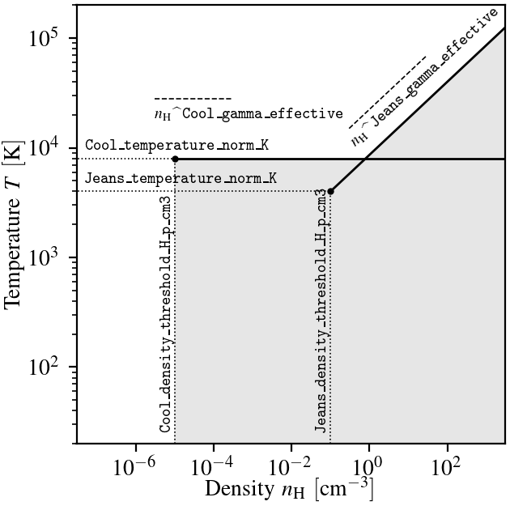

.. EAGLE sub-grid model
   Matthieu Schaller, 20th December 2018

EAGLE model
===========

This section of the documentation gives a brief description of the
different components of the EAGLE sub-grid model. We mostly focus on
the parameters and values output in the snapshots.

.. _EAGLE_entropy_floors:

Entropy floors
~~~~~~~~~~~~~~

The gas particles in the EAGLE model are prevented from cooling below a
certain temperature. The temperature limit depends on the density of the
particles. Two floors are used in conjonction. Both are implemented as
polytropic "equations of states" :math:`P = P_c
\left(\rho/\rho_c\right)^\gamma`, with the constants derived from the user
input given in terms of temperature and Hydrogen number density.

The first limit, labelled as ``Cool``, is typically used to prevent
low-density high-metallicity particles to cool below the warm phase because
of over-cooling induced by the absence of metal diffusion. This limit plays
only a small role in practice. The second limit, labelled as ``Jeans``, is
used to prevent the fragmentation of high-density gas into clumps that
cannot be resolved by the coupled hydro+gravity solver. The two limits are
sketched on the following figure. An additional over-density criterion is
applied to prevent gas not collapsed into structures from being
affected. This criterion demands that :math:`\rho > \Delta_{\rm floor}
\Omega_b \rho_{\rm crit}`, with :math:`\Delta_{\rm floor}` specified by the
user and :math:`\rho_{\rm crit}` the critical density at that redshift
[#f1]_.

	  in the EAGLE model.

    Temperature-density plane with the two entropy floors used in the EAGLE
    model indicated by the black lines. Gas particles are not allowed to be
    below either of these two floors; they are hence forbidden to enter the
    grey-shaded region. The floors are specified by the position in the
    plane of the starting point of each line (black circle) and their slope
    (dashed lines). The parameter names governing the behaviour of the
    floors are indicated on the figure. Note that unlike what is shown on
    the figure for clarity reasons, typical values for EAGLE runs place
    both anchors at the same temperature.

The model is governed by 4 parameters for each of the two
limits. These are given in the ``EAGLEEntropyFloor`` section of the
YAML file. The parameters are the Hydrogen number density (in
:math:`cm^{-3}`) and temperature (in :math:`K`) of the anchor point of
each floor as well as the power-law slope of each floor and the
minimal over-density required to apply the limit. For a normal
EAGLE run, that section of the parameter file reads:

.. code:: YAML

  EAGLEEntropyFloor:
     Jeans_density_threshold_H_p_cm3: 0.1       # Physical density above which the EAGLE Jeans limiter entropy floor kicks in, expressed in Hydrogen atoms per cm^3.
     Jeans_over_density_threshold:    10.       # Overdensity above which the EAGLE Jeans limiter entropy floor can kick in.
     Jeans_temperature_norm_K:        8000      # Temperature of the EAGLE Jeans limiter entropy floor at the density threshold, expressed in Kelvin.
     Jeans_gamma_effective:           1.3333333 # Slope of the EAGLE Jeans limiter entropy floor
     Cool_density_threshold_H_p_cm3:  1e-5      # Physical density above which the EAGLE Cool limiter entropy floor kicks in, expressed in Hydrogen atoms per cm^3.
     Cool_over_density_threshold:     10.       # Overdensity above which the EAGLE Cool limiter entropy floor can kick in.
     Cool_temperature_norm_K:         8000      # Temperature of the EAGLE Cool limiter entropy floor at the density threshold, expressed in Kelvin.
     Cool_gamma_effective:            1.        # Slope of the EAGLE Cool limiter entropy floor

SWIFT will convert the temperature normalisations and Hydrogen number
density thresholds into internal energies and densities respectively
assuming a neutral gas with primoridal abundance pattern. This implies
that the floor may not be exactly at the position given in the YAML
file if the gas has different properties. This is especially the case
for the temperature limit which will often be lower than the imposed
floor by a factor :math:`\frac{\mu_{\rm neutral}}{\mu_{ionised}}
\approx \frac{1.22}{0.59} \approx 2` due to the different ionisation
states of the gas.

Note that the model only makes sense if the ``Cool`` threshold is at a lower
density than the ``Jeans`` threshold.

.. _EAGLE_chemical_tracers:

Chemical tracers
~~~~~~~~~~~~~~~~

The gas particles in the EAGLE model carry metal abundance information in the
form of metal mass fractions. We follow explicitly 9 of the 11 elements that
`Wiersma et al. (2009)b <http://adsabs.harvard.edu/abs/2009MNRAS.399..574W>`_
traced in their chemical enrichment model. These are: `H`, `He`, `C`, `N`, `O`,
`Ne`, `Mg`, `Si` and `Fe` [#f2]_. We additionally follow the total metal mass fraction
(i.e. absolute metallicity) `Z`. This is typically larger than the sum of the 7
metals that are individually traced since this will also contain the
contribution of all the elements that are not individually followed.  We note
that all of definitions are independent of any definition of solar the solar
metallicity :math:`Z_\odot` or of any solar abundance pattern.

As part of the diagnostics, we additionally trace the elements coming
from the different stellar evolution channels. We store for each
particle the total mass coming from all the SNIa that enriched that
particle and the metal mass fraction from SNIa. This is the fraction
of the *total* gas mass that is in the form of metals originating from
SNIa stars. By construction this fraction will be smaller than the
total metal mass fraction. The same tracers exist for the SNII and AGB
channels. Finally, we also compute the iron gas fraction from
SNIa. This it the fraction of the *total* gas mass that is made of
iron originating from SNIa explosions. 

We finally also compute the smoothed versions of the individual
element mass fractions, of the total metal mass fractions, and of the
iron gas fraction from SNIa.

The chemistry module in ``src/chemistry/EAGLE/`` includes all the arrays
that are added to the particles and the functions used to compute the
smoothed elements.

When a star is formed (see the section :ref:`EAGLE_star_formation` below), it
inherits all the chemical tracers of its parent gas particle.

In the snapshots, we output for each gas and star particle:

+----------------------------------+-------------------------------------+-----------+-----------------------------+
| Name                             | Description                         | Units     | Comments                    |
+==================================+=====================================+===========+=============================+
| ``ElementAbundance``             | | Fraction of the gas/star mass     | [-]       | | Array of length           |
|                                  | | in the different elements         |           | | 9 for each particle       |
+----------------------------------+-------------------------------------+-----------+-----------------------------+
| ``SmoothedElementAbundance``     | | Fraction of the gas/star mass     | [-]       | | Array of length           |
|                                  | | in the different elements         |           | | 9 for each particle       |
|                                  | | smoothed over SPH neighbours      |           |                             |
+----------------------------------+-------------------------------------+-----------+-----------------------------+
| ``Metallicity``                  | | Fraction of the gas/star mass     | [-]       |                             |
|                                  | | in *all* metals                   |           |                             |
+----------------------------------+-------------------------------------+-----------+-----------------------------+
| ``SmoothedMetallicity``          | | Fraction of the gas/star mass     | [-]       |                             |
|                                  | | in *all* metals                   |           |                             |
|                                  | | smoothed over SPH neighbours      |           |                             |
+----------------------------------+-------------------------------------+-----------+-----------------------------+
| ``TotalMassFromSNIa``            | | Total mass of the gas/star        | [U_M]     |                             |
|                                  | | that was produced by enrichment   |           |                             |
|                                  | | from SNIa stars                   |           |                             |
+----------------------------------+-------------------------------------+-----------+-----------------------------+
| ``MetalMassFracFromSNIa``        | | Fraction of the *total* gas/star  | [-]       |                             |
|                                  | | mass that is in metals produced   |           |                             |
|                                  | | by enrichment from SNIa stars     |           |                             |
+----------------------------------+-------------------------------------+-----------+-----------------------------+
| ``TotalMassFromAGB``             | | Total mass of the gas/star        | [U_M]     |                             |
|                                  | | that was produced by enrichment   |           |                             |
|                                  | | from AGB stars                    |           |                             |
+----------------------------------+-------------------------------------+-----------+-----------------------------+
| ``MetalMassFracFromAGB``         | | Fraction of the *total* gas/star  | [-]       |                             |
|                                  | | mass that is in metals produced   |           |                             |
|                                  | | by enrichment from AGB star       |           |                             |
+----------------------------------+-------------------------------------+-----------+-----------------------------+
| ``TotalMassFromSNII``            | | Total mass of the gas/star        | [U_M]     |                             |
|                                  | | that was produced by enrichment   |           |                             |
|                                  | | from SNII stars                   |           |                             |
+----------------------------------+-------------------------------------+-----------+-----------------------------+
| ``MetalMassFracFromSNII``        | | Fraction of the gas/star mass     | [-]       |                             |
|                                  | | that is in metals produced by     |           |                             |
|                                  | | enrichment from SNII stars        |           |                             |
+----------------------------------+-------------------------------------+-----------+-----------------------------+
| ``IronMassFracFromSNIa``         | | Fraction of the *total* gas/star  | [-]       |                             |
|                                  | | mass in *iron* produced produced  |           |                             |
|                                  | | by enrichment from SNIa stars     |           |                             |
+----------------------------------+-------------------------------------+-----------+-----------------------------+
| ``SmoothedIronMassFracFromSNIa`` | | Fraction of the *total* gas/star  | [-]       |                             |
|                                  | | mass in *iron* produced produced  |           |                             |
|                                  | | by enrichment from SNIa stars     |           |                             |
|                                  | | smoothed over SPH neighbours      |           |                             |
+----------------------------------+-------------------------------------+-----------+-----------------------------+

The stars will lose mass over their lifetime (up to ~45%). The fractions will
remain unchanged but if one is interested in computing an absolute metal mass
(say) for a star, the ``InitialMass`` (see the section
:ref:`EAGLE_star_formation` below) of the star must be used.

The chemistry model only requires a small number of parameters to be specified
in the `EAGLEChemistry` section of the YAML file. These are the initial values
of the metallicity and element mass fractions. These are then applied at the
start of a simulation to *all* the *gas* particles. All 9 traced elements have
to be specified An example section, for primordial abundances (typical for a
cosmological run), is:

.. code:: YAML

   EAGLEChemistry:
     init_abundance_metal:        0.    # Mass fraction in *all* metals
     init_abundance_Hydrogen:     0.755 # Mass fraction in Hydrogen
     init_abundance_Helium:       0.245 # Mass fraction in Helium
     init_abundance_Carbon:       0.    # Mass fraction in Carbon
     init_abundance_Nitrogen:     0.    # Mass fraction in Nitrogen
     init_abundance_Oxygen:       0.    # Mass fraction in Oxygen
     init_abundance_Neon:         0.    # Mass fraction in Neon
     init_abundance_Magnesium:    0.    # Mass fraction in Magnesium
     init_abundance_Silicon:      0.    # Mass fraction in Silicon
     init_abundance_Iron:         0.    # Mass fraction in Iron

Whilst one would use the following values for solar abundances
(typical for an idealised low-redshift run):

.. code:: YAML

   EAGLEChemistry:
     init_abundance_metal:        0.014        # Mass fraction in *all* metals
     init_abundance_Hydrogen:     0.70649785   # Mass fraction in Hydrogen
     init_abundance_Helium:       0.28055534   # Mass fraction in Helium
     init_abundance_Carbon:       2.0665436e-3 # Mass fraction in Carbon
     init_abundance_Nitrogen:     8.3562563e-4 # Mass fraction in Nitrogen
     init_abundance_Oxygen:       5.4926244e-3 # Mass fraction in Oxygen
     init_abundance_Neon:         1.4144605e-3 # Mass fraction in Neon
     init_abundance_Magnesium:    5.907064e-4  # Mass fraction in Magnesium
     init_abundance_Silicon:      6.825874e-4  # Mass fraction in Silicon
     init_abundance_Iron:         1.1032152e-3 # Mass fraction in Iron

Individual element abundances for each particle can also be read
directly from the ICs. By default these are overwritten in the code by
the values read from the YAML file. However, users can set the
parameter ``init_abundance_metal`` to ``-1`` to make SWIFT ignore the
values provided in the parameter file:

.. code:: YAML

   EAGLEChemistry:
     init_abundance_metal:       -1     # Read the particles' metal mass fractions from the ICs.

The ICs must then contain values for these three fields (same as what
is written to the snapshots):

+----------------------------------+-------------------------------------+-----------+-----------------------------+
| Name                             | Description                         | Units     | Comments                    |
+==================================+=====================================+===========+=============================+
| ``ElementAbundance``             | | Fraction of the gas/star mass     | [-]       | | Array of length           |
|                                  | | in the different elements         |           | | 9 for each particle       |
+----------------------------------+-------------------------------------+-----------+-----------------------------+
| ``Metallicity``                  | | Fraction of the gas/star mass     | [-]       |                             |
|                                  | | in *all* metals                   |           |                             |
+----------------------------------+-------------------------------------+-----------+-----------------------------+
| ``IronMassFracFromSNIa``         | | Fraction of the *total* gas/star  | [-]       |                             |
|                                  | | mass in *iron* produced produced  |           |                             |
|                                  | | by enrichment from SNIa stars     |           |                             |
+----------------------------------+-------------------------------------+-----------+-----------------------------+

If these fields are absent, then a value of ``0`` will be used for all
of them, likely leading to issues in the way the code will run.

.. _EAGLE_cooling:
     
Gas cooling: Wiersma+2009a
~~~~~~~~~~~~~~~~~~~~~~~~~~

The gas cooling is based on the redshift-dependent tables of `Wiersma et
al. (2009)a <http://adsabs.harvard.edu/abs/2009MNRAS.393...99W>`_ that include
element-by-element cooling rates for the 11 elements (`H`, `He`, `C`, `N`, `O`,
`Ne`, `Mg`, `Si`, `S`, `Ca` and `Fe`) that dominate the total rates. The tables
assume that the gas is in ionization equilibrium with the cosmic microwave
background (CMB) as well as with the evolving X-ray and UV background from
galaxies and quasars described by the model of `Haardt & Madau (2001)
<http://adsabs.harvard.edu/abs/2001cghr.confE..64H>`_. Note that this model
ignores *local* sources of ionization, self-shielding and non-equilibrium
cooling/heating. The tables can be obtained from this `link
<http://virgodb.cosma.dur.ac.uk/swift-webstorage/CoolingTables/EAGLE/coolingtables.tar.gz>`_
which is a re-packaged version of the `original tables
<http://www.strw.leidenuniv.nl/WSS08/>`_. The code reading and interpolating the
table is located in the directory ``src/cooling/EAGLE/``.

The Wiersma tables containing the cooling rates as a function of redshift,
Hydrogen number density, Helium fraction (:math:`X_{He} / (X_{He} + X_{H})`) and
element abundance relative to the solar abundance pattern assumed by the tables
(see equation 4 in the original paper). As the particles do not carry the mass
fraction of `S` and `Ca`, we compute the contribution to the cooling rate of
these elements from the abundance of `Si`. More specifically, we assume that
their abundance by mass relative to the table's solar abundance pattern is the
same as the relative abundance of `Si` (i.e. :math:`[Ca/Si] = 0` and
:math:`[S/Si] = 0`). Users can optionally modify the ratios used for `S` and
`Ca`.

Above the redshift of Hydrogen re-ionization we use the extra table containing
net cooling rates for gas exposed to the CMB and a UV + X-ray background at
redshift nine truncated above 1 Rydberg. At the redshift or re-ionization, we
additionally inject a fixed user-defined amount of energy per unit mass to all
the gas particles.

In addition to the tables we inject extra energy from Helium re-ionization using
a Gaussian model with a user-defined redshift for the centre, width and total
amount of energy injected per unit mass.

For non-cosmological run, we use the :math:`z = 0` table and the interpolation
along the redshift dimension then becomes a trivial operation.

The cooling itself is performed using an implicit scheme (see the theory
documents) which for small values of the cooling rates is solved explicitly. For
larger values we use a bisection scheme. Users can alternatively use a
Newton-Raphson method that in some cases runs faster than the bisection
method. If the Newton-Raphson method does not converge after a few steps, the
code reverts to a bisection scheme, that is guaranteed to converge. The cooling
rate is added to the calculated change in energy over time from the other
dynamical equations. This is different from other commonly used codes in the
literature where the cooling is done instantaneously.

We note that the EAGLE cooling model does not impose any restriction on the
particles' individual time-steps. The cooling takes place over the time span
given by the other conditions (e.g the Courant condition).

Finelly, the cooling module also provides a function to compute the temperature
of a given gas particle based on its density, internal energy, abundances and
the current redshift. This temperature is the one used to compute the cooling
rate from the tables and similarly to the cooling rates, they assume that the
gas is in collisional equilibrium with the background radiation. The
temperatures are, in particular, computed every time a snapshot is written and
they are listed for every gas particle:

+---------------------+-------------------------------------+-----------+-------------------------------------+
| Name                | Description                         | Units     | Comments                            |
+=====================+=====================================+===========+=====================================+
| ``Temperature``     | | Temperature of the gas as         | [U_T]     | | The calculation is performed      |
|                     | | computed from the tables.         |           | | using quantities at the last      |
|                     |                                     |           | | time-step the particle was active |
+---------------------+-------------------------------------+-----------+-------------------------------------+

Note that if one is running without cooling switched on at runtime, the
temperatures can be computed by passing the ``--temparature`` runtime flag (see
:ref:`cmdline-options`). Note that the tables then have to be available as in
the case with cooling switched on.

The cooling model is driven by a small number of parameter files in the
`EAGLECooling` section of the YAML file. These are the re-ionization parameters,
the path to the tables and optionally the modified abundances of `Ca` and `S` as
well as the flag to attempt using the Newton-Raphson scheme to solve the
implicit problem. A valid section of the YAML file looks like:

.. code:: YAML

   EAGLECooling:
     dir_name:     /path/to/the/Wiersma/tables/directory # Absolute or relative path
     H_reion_z:            11.5      # Redhift of Hydrogen re-ionization
     He_reion_z_centre:     3.5      # Centre of the Gaussian used for Helium re-ionization
     He_reion_z_sigma:      0.5      # Width of the Gaussian used for Helium re-ionization
     He_reion_ev_p_H:       2.0      # Energy injected in eV per Hydrogen atom for Helium re-ionization.

And the optional parameters are:

.. code:: YAML

   EAGLECooling:
     Ca_over_Si_in_solar:       1.0 # (Optional) Value of the Calcium mass abundance ratio to solar in units of the Silicon ratio to solar. Default value: 1.
     S_over_Si_in_solar:        1.0 # (Optional) Value of the Sulphur mass abundance ratio to solar in units of the Silicon ratio to solar. Default value: 1.
     newton_integration:        0   # (Optional) Set to 1 to use the Newton-Raphson scheme for the explicit cooling problem.

.. _EAGLE_tracers:
     
Particle tracers
~~~~~~~~~~~~~~~~

Over the course of the simulation, the gas particles record some information
about their evolution. These are updated for a given particle every time it is
active. The EAGLE tracers module is located in the directory
``src/tracers/EAGLE/``. 

In the EAGLE model, we trace the maximal tempearature a particle has reached and
the time at which this happened. When a star is formed (see the section
:ref:`EAGLE_star_formation` below), it inherits all the tracer values of its parent
gas particle.  There are no parameters to the model but two values are added to
the snapshots for each gas and star particle:

+----------------------------------------+---------------------------------------+-----------+-----------------------------+
| Name                                   | Description                           | Units     | Comments                    |
+========================================+=======================================+===========+=============================+
| | ``Maximal Temperature``              | | Mximal temperature reached by       | | [U_T]   |                             |
|                                        | | this particle.                      |           |                             |
+----------------------------------------+---------------------------------------+-----------+-----------------------------+
| | ``Maximal Temperature scale-factor`` | | Scale-factor (cosmological runs)    | | [-]     |                             |
| | OR                                   | | or time (non-cosmological runs) at  | | OR      |                             |
| | ``Maximal Temperature time``         | | which the maximum value was reached.| | [U_t]   |                             |
+----------------------------------------+---------------------------------------+-----------+-----------------------------+

.. _EAGLE_star_formation:

Star formation: Schaye+2008
~~~~~~~~~~~~~~~~~~~~~~~~~~~

.. _EAGLE_enrichment:

Stellar enrichment: Wiersma+2009b
~~~~~~~~~~~~~~~~~~~~~~~~~~~~~~~~~

.. _EAGLE_feedback:

Supernova feedback: Dalla Vecchia+2012
~~~~~~~~~~~~~~~~~~~~~~~~~~~~~~~~~~~~~~

.. _EAGLE_black_hole_seeding:

Black-hole creation
~~~~~~~~~~~~~~~~~~~

.. _EAGLE_black_hole_accretion:

Black-hole accretion
~~~~~~~~~~~~~~~~~~~~

.. _EAGLE_black_hole_feedback:

AGN feedback
~~~~~~~~~~~~

.. [#f1] Recall that in a non-cosmological run the critical density is
	 set to 0, effectively removing the over-density
	 constraint of the floors.

.. [#f2] `Wiersma et al. (2009)b
	 <http://adsabs.harvard.edu/abs/2009MNRAS.399..574W>`_ originally also
	 followed explicitly `Ca` and and `S`. They are omitted in the EAGLE
	 model but, when needed, their abundance with respect to solar is
	 assumed to be the same as the abundance of `Si` with respect to solar
	 (See the section :ref:`EAGLE_cooling`)

