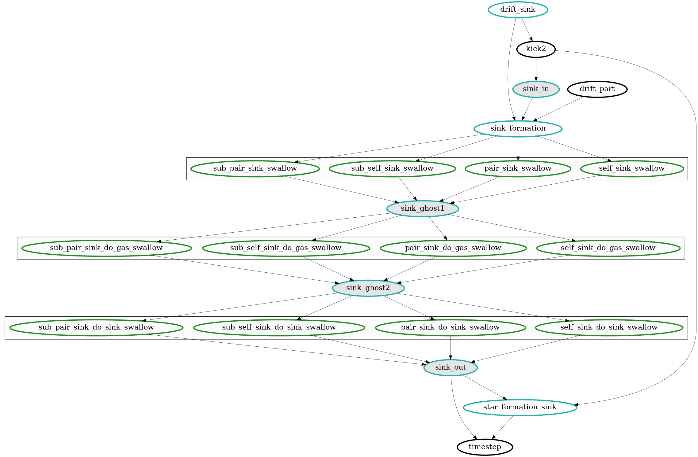

.. Sink particles in GEAR model
   Darwin Roduit, 15 March 2024

.. sink_GEAR_model:

.. warning::
  This page is under construction. It may lack information. 

Model summary
-------------

Here, we provide a comprehensive summary of the model. Sink particles are an alternative to the current model of star formation that transforms gas particles into sink particles under some criteria explained below. Then, the sink can accrete gas and spawn stars. 

To spawn stars, an IMF is sampled. Details explanation of the IMF sampling are explained below. In short, the IMF is split into two parts In the lower part, star particles represent continuous stellar population in a similar way than what is currently implemented in common models. In the second upper part, star particles represent individual stars. Then, the feedback is improved to take into account both type of stars. Currently, only supernovae feedback is implemented. The sink particle method allows thus to track the effect of the supernovae of individual stars in the simulation.

The current model includes sink formation, gas accretion, sink merging, IMF sampling and star spawning and finally supernove feedback (type Ia and II).

Our main references are the following papers `Bate et al. <https://ui.adsabs.harvard.edu/abs/1995MNRAS.277..362B/abstract>`_, `Price et al. <https://ui.adsabs.harvard.edu/abs/2018PASA...35...31P/abstract>`_ and `Federrath et al. <https://ui.adsabs.harvard.edu/abs/2010ApJ...713..269F/abstract>`_

    This figure shows the task dependencies for the sink scheme.
    The first rectangle groups the tasks that determine if sink particles will swallow other
    sink particles or gas particles.
    In the second one, the gas particles tagged as "to be swallowed" are effectively swallowed.
    In the third one, the sink particles tagged as "to be swallowed" are effectively swallowed.
    This was done with SWIFT v0.9.0.

Conversion from comoving to physical space
------------------------------------------

In the following, we always refer to physical quantities. In non-cosmological quantities, there is no ambiguity since there is non expansion of the universe to account for and thus no scale factor :math:`a(t)`. However, in cosmological simulation, we need to take care to convert from comoving quantities to physical ones when needed, e.g. to compute energies. Here is a recap:

* :math:`\mathbf{x}_p = \mathbf{x}_ca`
* :math:`\mathbf{v}_p = \mathbf{v}_c/a + a H \mathbf{x}_c`
* :math:`\rho_p = \rho_c/a^3`
* :math:`\Phi_p = \Phi_c/a + c(a)`

Here, the subscript `p` stands for physical and `c` for comoving. 

Notice that the potential normalization constant has been chosen to be :math:`c(a) = 0`. 

Sink formation
--------------

Notice however than contrary to  `Bate et al. <https://ui.adsabs.harvard.edu/abs/1995MNRAS.277..362B/abstract>`_, no boundary conditions for sink particles are indtroduced in the hydrodynamics calculations.

Gas accretion
-------------

Sink merging
------------

IMF sampling
------------

Star spawning
-------------
