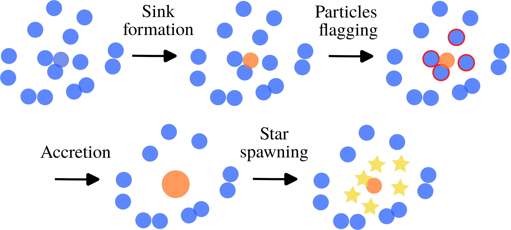
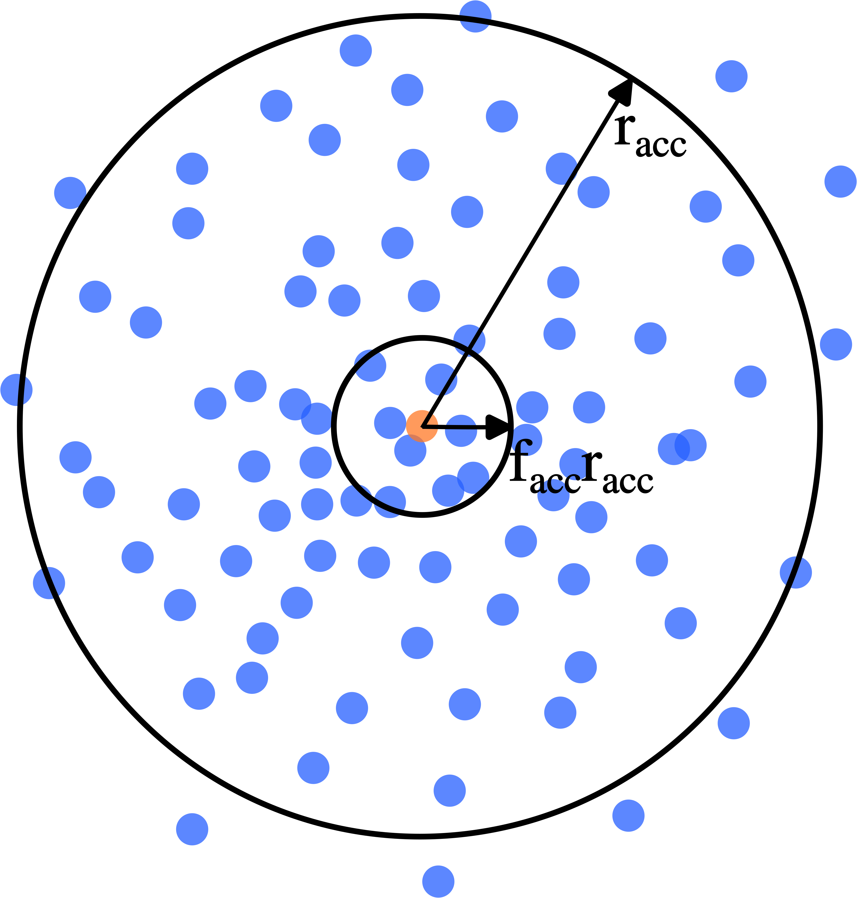
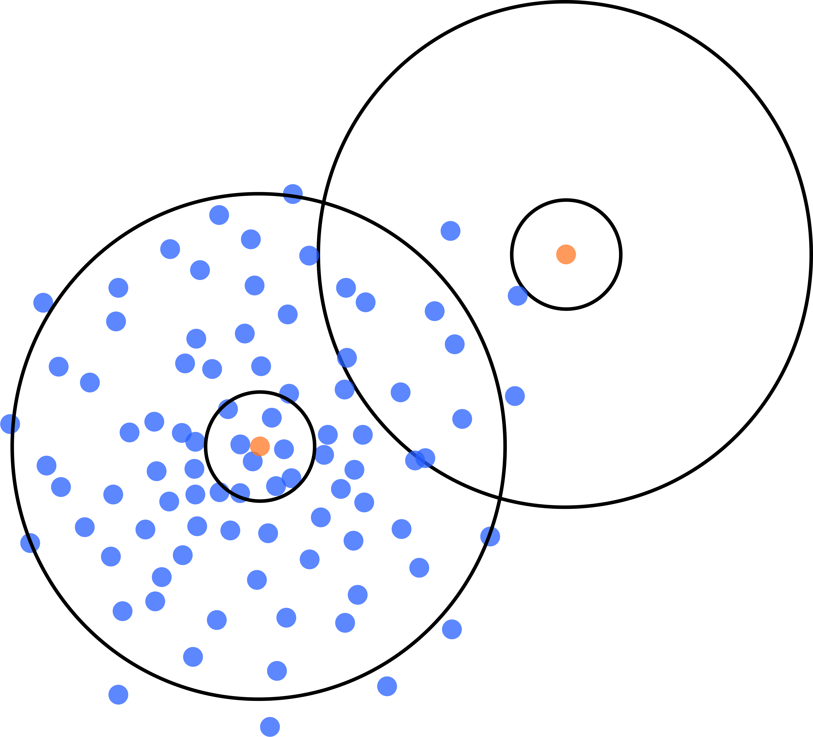
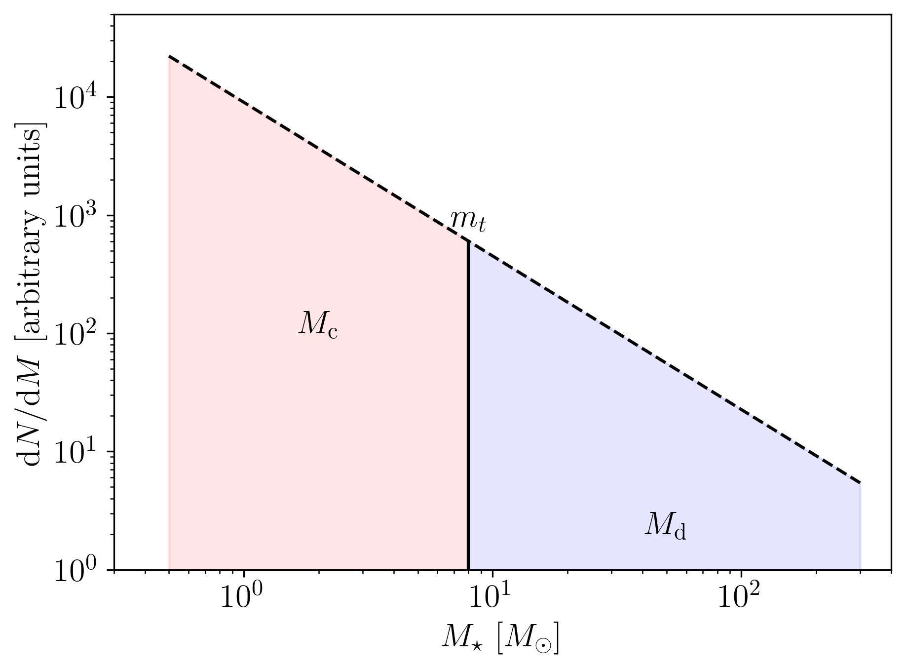

.. Sink particles in GEAR model
   Darwin Roduit, 17 April 2024

.. _sink_GEAR_model_summary:

Model summary
-------------

    This figure illustrates the sink scheme. Eligible gas particles (blue) are converted to sink particles (orange). Then, the sink searches for eligible gas/sink particles (red edges) to swallow and finally accretes them. The final step is to spawn star particles (yellow) by sampling an IMF. These stars represent a continuous portion of the IMF or an individual star (the figure does not distinguish the two types of stars).

Here, we provide a comprehensive summary of the model. Sink particles are an alternative to the current model of star formation that transforms gas particles into sink particles under some criteria explained below. Then, the sink can accrete gas and spawn stars. Sink particles are collisionless particles, i.e. they interact with other particles only through gravity. They can be seen as particles representing unresolved regions of collapse. 

We sample an IMF to draw the stars' mass and spawn them stochastically. Below, we provide a detailed explanation of the IMF sampling. In short, we split the IMF into two parts. In the lower part, star particles represent a continuous stellar population, similar to what is currently implemented in standard models. In the second upper part, star particles represent individual stars. Then, the feedback is improved to take into account both types of stars. Currently, only supernovae feedback is implemented. Thus, the sink particle method allows us to track the effects of individual stars' supernovae in the simulation. 

The current model includes sink formation, gas accretion, sink merging, IMF sampling, star spawning and finally supernovae feedback (type Ia and II). The figures below illustrates the scheme and the associated tasks.

Our main references are the following papers: `Bate et al. <https://ui.adsabs.harvard.edu/abs/1995MNRAS.277..362B/abstract>`_, `Price et al. <https://ui.adsabs.harvard.edu/abs/2018PASA...35...31P/abstract>`_ and `Federrath et al. <https://ui.adsabs.harvard.edu/abs/2010ApJ...713..269F/abstract>`_

.. note::
   Sink examples are available in ``examples/SinkParticles/``. They include self-gravity, cooling and feedback effects.

.. figure:: ../../../Task/sink.png
    :width: 400px
    :align: center
    :figclass: align-center
    :alt: Task dependencies for the sink scheme.

    This figure shows the task dependencies for the sink scheme.
    The first rectangle groups the tasks that determine if sink particles will swallow other
    sink particles or gas particles.
    In the second one, the gas particles tagged as "to be swallowed" are effectively swallowed.
    In the third one, the sink particles tagged as "to be swallowed" are effectively swallowed.
    This was done with SWIFT v0.9.0.

Conversion from comoving to physical space
~~~~~~~~~~~~~~~~~~~~~~~~~~~~~~~~~~~~~~~~~~

In the following, we always refer to physical quantities. In non-cosmological simulations, there is no ambiguity between comoving and physical quantities since the universe is not expanding, and thus, the scale factor is :math:`a(t)=1`. However, in cosmological simulation, we need to convert from comoving quantities to physical ones when needed, e.g. to compute energies. We denote physical quantities by the subscript `p` and comoving ones by `c`. Here is a recap:

* :math:`\mathbf{x}_p = \mathbf{x}_c a`
* :math:`\mathbf{v}_p = \mathbf{v}_c/a + a H \mathbf{x}_c`
* :math:`\rho_p = \rho_c/a^3`
* :math:`\Phi_p = \Phi_c/a + c(a)`
* :math:`u_p = u_c/a^{3(\gamma -1)}`

Here, :math:`H` is the Hubble constant at any redshift, :math:`c(a)` is the potential normalization constant and :math:`\gamma` the gas adiabatic index. Notice that the potential normalization constant has been chosen to be :math:`c(a) = 0`.

Sink formation
~~~~~~~~~~~~~~

    This figure shows a sink particle (in orange) newly formed among other gas particles (in blue). The accretion radius is :math:`r_{\text{acc}}`. It is the one used for sink formation. There is also an inner accretion radius :math:`f_{\text{acc}} r_{\text{acc}}` (:math:`0 \leq f_{\text{acc}} \leq 1`) that is used for gas swallowing. Particles within this inner radius are eaten without passing any other check, while particles between the two radii pass some check before being swallowed. 

At the core of the sink particle method is the sink formation algorithm. This is critical to form sinks in regions adequate for star formation. Failing to can produce spurious sinks and stars, which is not desirable. However, there is no easy answer to the question. We chose to implement a simple and efficient algorithm.
The primary criteria required to transform a gas particle into a sink are:

1. the density of a given particle :math:`i` is bigger than a user-defined threshold density: :math:`\rho_i > \rho_{\text{threshold}}` ;
2. the temperature of a given particle is smaller than a user-defined threshold temperature: :math:`T_i < T_{\text{threshold}}`. 

The first criterion is common but not the second one. This is checked to ensure that sink particles, and thus stars, are not generated in hot regions. The parameters for those threshold quantities are respectively called ``density_threshold_g_per_cm3`` and ``maximal_temperature``.

Then, further criteria are checked. They are always checked for gas particles within the accretion radius :math:`r_{\text{acc}}` (called the ``cut_off_radius`` in the parameter file) of a given gas particle :math:`i`. Such gas particles are called *neighbours*.

.. note::
   Notice that in the current implementation, the accretion radius is kept *fixed and the same* for all sinks. However, for the sake of generality, the mathematical expressions are given as if the accretion radii could be different. 

So, the other criteria are the following:

3. The gas particle is at a local potential minimum: :math:`\Phi_i = \min_j \Phi_j`.
4. Gas surrounding the particle is at rest or collapsing: :math:`\nabla \cdot \mathbf{v}_{i, p} \leq 0`. (Optional)
5. The smoothing kernel's edge of the particle is less than the accretion radius: :math:`\gamma_k h_i < r_{\text{acc}}`, where :math:`\gamma_k` is kernel dependent. (Optional)
6. All neighbours are currently active.
7. The thermal energy of the neighbours satisfies: :math:`E_{\text{therm}} < |E_{\text{pot}}|/2`. (Optional, together with criterion 8.)
8. The sum of thermal energy and rotational energy satisfies: :math:`E_{\text{therm}} + E_{\text{rot}} < | E_{\text{pot}}|`. (Optional, together with criterion 7.)
9. The total energy of the neighbours is negative, i.e. the clump is bound to the sink: :math:`E_{\text{tot}} < 0`. (Optional)
10. Forming a sink here will not overlap an existing sink :math:`s`: :math:`\left| \mathbf{x}_i - \mathbf{x}_s \right| > r_{\text{acc}, i} + r_{\text{acc}, s}`. (Optional)

Some criteria are *optional* and can be *deactivated*. By default, they are all enabled. The different energies are computed as follows:

* :math:`E_{\text{therm}} = \displaystyle \sum_j m_j u_{j, p}`
* :math:`E_{\text{kin}} = \displaystyle \frac{1}{2} \sum_j m_j (\mathbf{v}_{i, p} - \mathbf{v}_{j, p})^2`
* :math:`E_{\text{pot}} = \displaystyle \frac{G_N}{2} \sum_j m_i m_j \Phi_{j, p}`
* :math:`E_{\text{rot}} = \displaystyle \sqrt{E_{\text{rot}, x}^2 + E_{\text{rot}, y}^2 + E_{\text{rot}, z}^2}`
* :math:`E_{\text{rot}, x} = \displaystyle \frac{1}{2} \sum_j m_j \frac{L_{ij, x}^2}{\sqrt{(y_{i, p} - y_{j, p})^2 + (z_{i,p} - z_{j, p})^2}}`
* :math:`E_{\text{rot}, y} = \displaystyle \frac{1}{2} \sum_j m_j \frac{L_{ij, y}^2}{\sqrt{(x_{i,p} - x_{j,p})^2 + (z_{i,p} - z_{j,p})^2}}`
* :math:`E_{\text{rot}, z} = \displaystyle \frac{1}{2} \sum_j m_j \frac{L_{ij, z}^2}{\sqrt{(x_{i, p} - x_{j, p})^2 + (y_{i,p} - y_{j,p})^2}}`
* The  (physical) specific angular momentum: :math:`\mathbf{L}_{ij} = ( \mathbf{x}_{i, p} - \mathbf{x}_{j, p}) \times ( \mathbf{v}_{i, p} - \mathbf{x}_{j, p})`
* :math:`E_{\text{mag}} = \displaystyle \sum_j E_{\text{mag}, j}`
* :math:`E_{\text{tot}} = E_{\text{kin}} + E_{\text{pot}} +  E_{\text{therm}} + E_{\text{mag}}`

.. note::
   Currently, magnetic energy is not included in the total energy, since the MHD scheme is in progress. However, the necessary modifications have already been taken care of.

   The :math:`p` subscript is to recall that we are using physical quantities to compute energies.

   Here, the potential is retrieved from the gravity solver. 

Some comments about the criteria:

The third criterion is mainly here to prevent two sink particles from forming at a distance smaller than the sink accretion radius. Since we allow sinks to merge, such a situation raises the question of which sink should swallow the other. This can depend on the order of the tasks, which is not a desirable property. As a result, this criterion is enforced.

The tenth criterion prevents the formation of spurious sinks. Experiences have shown that removing gas within the accretion radius biases the hydro density estimates: the gas feels a force toward the sink. At some point, there is an equilibrium and gas particles accumulate at the edge of the accretion radius, which can then spawn sink particles that do not fall onto the primary sink and never merge. Moreover, the physical reason behind this criterion is that a sink represents a region of collapse. As a result, there is no need to have many sinks occupying the same space volume. They would compete for gas accretion without necessarily merging. This criterion is particularly meaningful in cosmological simulations to ensure proper sampling of the IMF. *This criterion can be disabled*.

.. note::
  However, notice that contrary to  `Bate et al. <https://ui.adsabs.harvard.edu/abs/1995MNRAS.277..362B/abstract>`_, no boundary conditions for sink particles are introduced in the hydrodynamics calculations.

.. note::
   Note that sink formation can be disabled. It can be useful, for example if you already have sinks in your initial conditions. 

Gas accretion
~~~~~~~~~~~~~

Now that sink particles can populate the simulation, they need to swallow gas particles. To be accreted, gas particles need to pass a series of criteria. In the following, :math:`s` denotes a sink particle and :math:`i` is a gas particle. The criteria are the following:

#. If the gas falls within :math:`f_{\text{acc}} r_{\text{acc}}` (:math:`0 \leq f_{\text{acc}} \leq 1`), the gas is accreted without further check.
#. In the region  :math:`f_{\text{acc}} r_{\text{acc}} \leq |\mathbf{x}_i| \leq r_{\text{acc}}`, then, we check:
   
   #. The specific angular momentum is smaller than the one of a Keplerian orbit at :math:`r_{\text{acc}}`: :math:`|\mathbf{L}_{si}| \leq |\mathbf{L}_{\text{Kepler}}|`.
   #. The gas is gravitationally bound to the sink particle: :math:`E_{\text{tot}} < 0`.
   #. Out of all pairs of sink-gas, the gas is the most bound to this one. This case is illustrated in the figure below. 

The physical specific angular momenta and the total energy are given by:

* :math:`\mathbf{L}_{si} = ( \mathbf{x}_{s, p} - \mathbf{x}_{i, p}) \times ( \mathbf{v}_{s, p} - \mathbf{x}_{i, p})`,
* :math:`|\mathbf{L}_{\text{Kepler}}| = r_{\text{acc}, p} \cdot \sqrt{G_N m_s / |\mathbf{x}_{s, p} - \mathbf{x}_{i, p}|^3}`.
* :math:`E_{\text{tot}} = \frac{1}{2}  (\mathbf{v}_{s, p} - \mathbf{x}_{i, p})^2 - G_N \Phi(|\mathbf{x}_{s, p} - \mathbf{x}_{i, p}|) + m_i u_{i, p}`.

.. note::
   Here the potential is the softened potential of Swift.

Those criteria are similar to `Price et al. <https://ui.adsabs.harvard.edu/abs/2018PASA...35...31P/abstract>`_, with the addition of the internal energy. This term ensures that the gas is cold enough to be accreted. Its main purpose is to avoid gas accretion and star spawning in hot regions far from sink/star-forming regions, which can happen, e.g., if a sink leaves a galaxy.

Once a gas is eligible for accretion, its properties are assigned to the sink. The sink accretes the *entire* gas particle mass and its properties are updated in the following way:

* :math:`\displaystyle \mathbf{v}_{s, c} = \frac{m_s \mathbf{v}_{s, c} + m_i \mathbf{v}_{i, c}}{m_s + m_i}`,
* Swallowed physical angular momentum:  :math:`\mathbf{L}_{\text{acc}} = \mathbf{L}_{\text{acc}} + m_i( \mathbf{x}_{s, p} - \mathbf{x}_{i, p}) \times ( \mathbf{v}_{s, p} - \mathbf{x}_{i, p})`,
* :math:`X_{Z, s} = \dfrac{X_{Z,i} m_i + X_{Z,s} m_s}{m_s + m_i}`, the metal mass fraction for each element,
* :math:`m_s = m_s + m_i`.

    This figure shows two sink particles (in orange) with gas particles (in blue) falling in the accretion radii of both sinks. In such cases, the gas particles in the overlapping regions are swallowed by the sink they are the most bound to. 

Sink merging
~~~~~~~~~~~~

Sinks are allowed to merge if they enter one's accretion radius. We merge two sink particles if they respect a set of criteria. The criteria are similar to the gas particles, namely:

#. If one of the sinks falls within the other's inner accretion radius, :math:`f_{\text{acc}} r_{\text{acc}}` (:math:`0 \leq f_{\text{acc}} \leq 1`), the sinks are merged without further check.
#. In the region  :math:`f_{\text{acc}} r_{\text{acc}} \leq |\mathbf{x}_i| \leq r_{\text{acc}}`, then, we check:

   #. One sink is gravitationally bound to the other: :math:`E_{\text{mec}, ss'} < 0` or  :math:`E_{\text{mec}, s's} < 0`.

We compute the total energies in the same manner as gas particles, with the difference that we do not use internal energy. Notice that we have two energies: each sink has a different potential energy since their mass can differ.

When sinks merge, the sink with the smallest mass merges with the sink with the largest. If the two sinks have the same mass, we check the sink ID number and add the smallest ID to the biggest one.

IMF sampling
~~~~~~~~~~~~

    This figure shows an IMF split into two parts by :math:`m_t`: the continuous (orange) and the discrete (blue) part.

Now remains one critical question: how are stars formed in this scheme? Simply, by sampling an IMF. 
In our scheme, population III stars and population II have two different IMFs. For the sake of simplicity, in the following presentation, we consider only the case of population II stars. However, this can be easily generalized to population III. 

Consider an IMF such as the one above. We split it into two parts at ``minimal_discrete_mass_Msun`` (called :math:`m_t` on the illustration). The reason behind this is that we want to spawn star particles that represent *individual* (massive) stars, i.e. they are "discrete". However, for computational reasons, we cannot afford to spawn every star of the IMF as a single particle. Since the IMF is dominated by low-mass stars (< 8 :math:`M_\odot` and even smaller) that do not end up in supernovae, we would have lots of "passive" stars.

.. note::
   Recall that currently (July 2024), GEAR only implements SNIa and SNII as stellar feedback. Stars that do not undergo supernovae phases are "passive" in the current implementation.

As a result, we group all those low-mass stars in one stellar particle of mass ``stellar_particle_mass_Msun``. Such star particles are called "continuous", contrary to the "discrete" individual stars.  With all that information, we can compute the number of stars in the continuous part of the IMF (called :math:`N_c`) and in the discrete part (called :math:`N_d`). Finally, we can compute the probabilities of each part, respectively called :math:`P_c` and :math:`P_d`. Notice that the mathematical derivation is given in the theory latex files.

Thus, the algorithm to sample the IMF and five the sink their ``target_mass`` is the following :

* draw a random number :math:`\chi`  from a uniform distribution in the interval :math:`(0 , \; 1 ]`;
* if  :math:`\chi < P_c`: ``sink.target_mass = stellar_particle_mass``;
* else: ``sink_target_mass = sample_IMF_high()``.

We have assumed that we have a function ``sample_IMF_high()`` that correctly samples the IMF in the discrete part.

Now, what happens to the sink? After a first sink forms, we give it a target mass with the algorithm outlined above. The sink then swallows gas particles (see the task graph at the top of the page) and finally spawns stars.  While the sink possesses enough mass, we can continue to choose a new target mass. When the sink does have enough mass, the algorithm stops for this timestep. The next timestep, the sink may accrete gas and spawn stars again. If the sink never reaches the target mass, then it cannot spawn stars. In practice, however, sink particles could accumulate enough pass to spawn individual (Pop III) stars with masses 240 :math:`M_\odot` and more!

As explained at the beginning of this section, GEAR uses two IMFs for the population of II and III stars. The latter are called the first stars in the code. How does a sink decide which IMF to draw the target mass from? We define a threshold metallicity, ``GEARFeedback:imf_transition_metallicity`` that determines the first stars' maximal metallicity. When the sink particle's metallicity exceeds this threshold, it uses the population II IMF, defined in ``GEARFeedback:yields_table``.

Star spawning
~~~~~~~~~~~~~

Once the sink spawns a star particle, we need to give properties to the star. From the sink, the star inherits the chemistry properties. The star is placed randomly within the sink's accretion radius. We draw the star's velocity components from a Gaussian distribution with mean :math:`\mu = 0` and standard deviation :math:`\sigma` determined as follows:

.. math::
   \sigma = f \cdot \sqrt{\frac{G_N M_s}{r_{\text{acc}}}} \; ,

where :math:`G_N` is Newton's gravitational constant, math:`M_s` is the sink's mass before starting to spawn stars, and :math:`f` is a user-defined scaling factor. The latter corresponds to the ``star_spawning_sigma_factor`` parameter.

Stellar feedback
~~~~~~~~~~~~~~~~

Stellar feedback *per se* is not in the sink module but in the feedback one. However, if one uses sink particles with individual stars, the feedback implementation must be adapted. Here is a recap of the GEAR feedback with sink particles. 

All details and explanations about GEAR stellar feedback are provided in the GEAR :ref:`gear_feedback` section. Here, we only provide the changes from the previous model. 

In the previous model, star particles represented a population of stars with a defined IMF. Now, we have two kinds of star particles: particles representing a *continuous* portion of the IMF (see the image above) and particles representing a *single* (discrete) star. This new model requires updating the feedback model so that stars eligible for SN feedback can realise this feedback.

**Discrete star particles:** Since we now have individual star particles, we can easily track SNII feedback for stars with a mass larger than 8 :math:`M_\odot`. When a star's age reaches its lifetime, it undergoes SNII feedback.

**Continuous star particles**: In this case, we implemented SNII and SNIa as in the previous model. At each timestep, we determine the number of SN explosions occurring. In practice, this means that we can set the ``minimal_discrete_masss`` to any value, and the code takes care of the rest.
