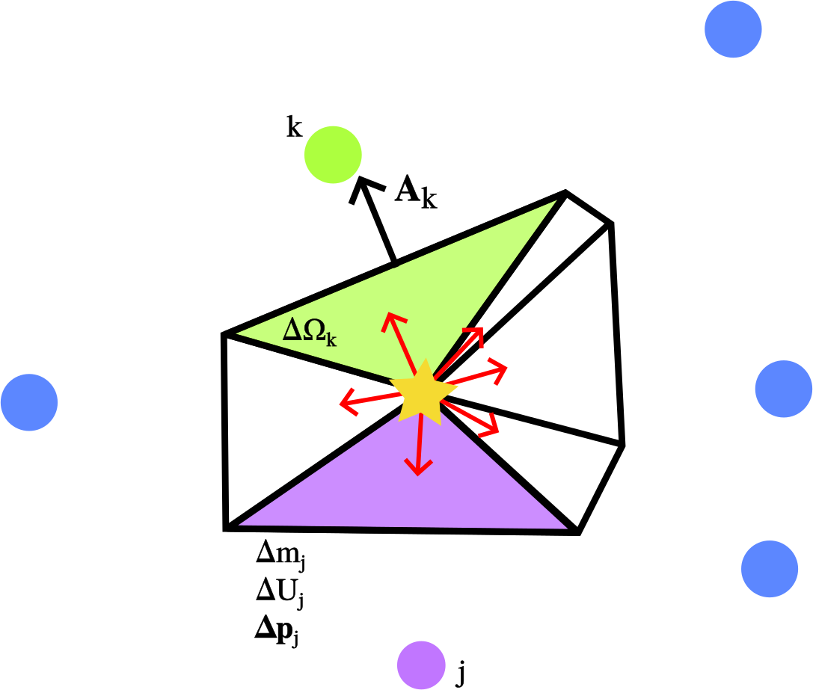

.. Supernova feedback in GEAR model
   Darwin Roduit, 30 March 2025

.. gear_sn_feedback_models:

.. _gear_sn_feedback_models:

GEAR supernova feedback
=======================

When a star goes into a supernova, we compute the amount of internal energy, mass and metals the explosion transfers to the star's neighbouring gas particles. We will group all these in the “fluxes” term.
We have two models for the distribution of these fluxes and the subgrid modelling of the supernovae: GEAR model and GEAR mechanical model.

.. note::
   We may sometimes refer to GEAR feedback as GEAR thermal feedback to clearly distinguish it from GEAR mechanical feedback.

.. _gear_sn_feedback_gear_thermal:

GEAR model
----------

In the GEAR (thermal) model, the fluxes are distributed by weighing with the SPH kernel:

.. math::

   w_{{sj}} = W_i(\| \vec{{x}}_{{sj}} \|, \, h_s) \frac{{m_j}}{{\rho_s}}

for :math:`s` the star and :math:`j` the gas (`Revaz and Jablonka 2012 <https://ui.adsabs.harvard.edu/abs/2012A%26A...538A..82R/abstract>`_).

In the GEAR model, we do not inject momentum, only *internal energy*. Then, internal energy conversion to kinetic energy is left to the hydrodynamic solver, which will compute appropriately the gas density, temperature and velocity.
However, if the cooling radius :math:`R_{\text{cool}}` of the explosion is unresolved, i.e. the cooling radius is smaller than our simulation resolution, the cooling radiates away the internal energy.

To understand why this happens, let us remind the main phases of an SN explosion in a homogeneous medium. We provide a simple picture that is more complicated than the one explained here. See `Haid et al. 2016 <https://ui.adsabs.harvard.edu/abs/2016MNRAS.460.2962H/abstract>`_ or `Thornton et al. 1998 <https://iopscience.iop.org/article/10.1086/305704>`_ for further details.

* The first stage of the SN explosion is the **free expansion**. In this momentum-conserving regime, the ejecta of the stars sweeps the ISM. At the end of this phase, 72% of the initial SN energy has been converted to thermal energy.
* Once the SN ejecta has swept an ISM mass of comparable mass, the blast wave enters the **energy-conserving Sedov-Taylor phase**. It continues with an adiabatic expansion, performing some :math:`P \, \mathrm{d}V` work on the gas. In this phase, the internal energy is converted into kinetic energy as the ejecta continues sweeping the ISM gas. This phase continues until radiative losses become significant after some radius :math:`R_{\text{cool}}`.
* At this point, the blast wave enters the **momentum-conserving snowplough phase** and forms a thin shell. In this regime, efficient cooling radiates away the internal energy, and thus, the blast wave slows down.

Now, we better understand why the internal energy is radiated away. It is a consequence of efficient cooling in the snowplough phase. When this happens, the feedback is unresolved and its energy does not affect the ISM, apart from the mass and metal injection. To circumvent this problem, GEAR thermal feedback implements a **fixed delayed cooling mechanism**. The cooling of the particles affected by feedback is deactivated during some mega year, usually 5 Myr in our simulations. The time is controlled by the ``GrackleCooling:thermal_time_myr`` parameter. This mechanism allows the internal energy to transform into kinetic energy without immediately being radiated away. However, such an approach poses the question of the time required to prevent gas from cooling in the simulations.

GEAR mechanical model
---------------------

We implemented two mechanical feedback schemes to better model the blast wave expansion by considering the most critical phases of the SN explosion. These two new models are called GEAR mechanical 1 and GEAR mechanical 2.

Our implementations are based on the work of `Hopkins et al. 2018 <https://ui.adsabs.harvard.edu/abs/2018MNRAS.477.1578H/abstract>`_ and `Hopkins 2024 <https://ui.adsabs.harvard.edu/abs/2024arXiv240416987H/abstract>`_. The first implementation was used in Fire 2 and the second one is a simplified version of the Fire 3 implementation. These two implementations differ in their treatment of energy distribution energy and, thus, momentum to distribute. They will allow us to eliminate the delayed cooling and ensure that feedback events are resolved.

.. note::
   We only have implemented the flux distribution and the flux injection. The stellar evolution is identical to GEAR model. 

Neighbour finding
+++++++++++++++++

When a star :math:`s` is eligible for feedback, it looks for its neighbour :math:`j`, i.e. gas particles within the star's smoothing length :math:`H_s = \gamma_k h_a`. Such interactions are called non-symmetric since we only look for gas particles the *star sees*. This is the neighbour-finding strategy of the GEAR thermal feedback and the other SWIFT feedback modules. However, in the GEAR mechanical feedback, we also consider gas particles :math:`j` *that see the star* :math:`s`, i.e. the star is within their smoothing length :math:`H_j = \gamma_k h_j`. Such interactions are called *symmetric*. In summary, we consider all neighbour gas particles :math:`j` such that :math:`r_{sj} \equiv \| \vec{x}_{s} - \vec{x}_j \| < H_s` or :math:`r_{sj} < H_j`.

Symmetric interactions enable us to consider gas particles that are farther away but still see the star and are eligible (in this model) for feedback. For instance, in our cosmological simulations, star form in dense disk-like regions :math:`\rho > 1000-10000 \text{ Hydrogen atoms/cm}^3`, which have small smoothing lengths, :math:`h \lesssim 1 \text{ pc}`. In the vertical plane of the disk, gas particles are not seen by the star particles, but they have smoothing lengths encompassing the disk gas particles and stars. With this symmetric interaction, they are guaranteed to receive the feedback. The symmetric interaction also enables better isotropy in the distribution of fluxes, as we present below. `Hopkins et al. 2018 <https://ui.adsabs.harvard.edu/abs/2018MNRAS.477.1578H/abstract>`_ validated the symmetric interaction in their tests and reported that not using it biases the feedback deposition.

Finally, we implemented a maximal neighbour search radius, :math:`r_{\text{max}} = 2 \text{ kpc}` by default, to prevent costly neighbour finding and unphysical fluxes deposition, e.g. injecting metals at high distance from the star. 

Isotropic distribution of fluxes
++++++++++++++++++++++++++++++++

.. note::
   We could reproduce Hopkins conclusion. We provide the setup and the analysis scripts in example XXX. 

We changed the SPH weighting method to solid angle weighted scheme. This scheme is guaranteed to be be isotropic in the star :math:`s` reference frame located at :math:`\vec{x}_s`. The scalar weights are based on the solid angles :math:`\Delta \Omega_j` subtended by the gas particles :math:`j` and defined by :math:`\omega_j = \Delta \Omega_j / 4 \pi`. To construct the solid angles :math:`\Delta \Omega_j`, we construct a set of faces that enclose the source star :math:`s` with some convex hull. We assign each face a vector-oriented area :math:`\vec{A}_j`. Then, we can construct the scalar weight, and thus the solid angle perceived by :math:`s`, as:

.. math::

   \omega_j \equiv \frac{1}{2} \left( 1 - \frac{1}{\sqrt{1 + \frac{\vec{A}_j \cdot \hat{x}_{js}}{\pi \lVert \vec{x}_{js} \rVert^2 }}} \right) \approx \frac{\Delta \Omega_j}{4 \pi} \, ,

where :math:`\hat{x}_{js}` is the unit vector oriented as :math:`\vec{x}_{js}`. This obscure formula \citep{hopkins_sn_2018} interpolates between :math:`1/2` for :math:`\| \vec{x}_{js}\|^2 \ll \| \vec{A}_j \cdot \hat{x}_{js} \|` and :math:`\| \vec{A}_j \cdot \hat{x}_{js} \| / (4 \pi \| \vec{x}_{js} \|^2)` for :math:`\| \vec{x}_{js} \|^2 \gg \| \vec{A}_j \cdot \hat{x}_{js} \|`. 

We need to construct the convex hull and face vectors :math:`\vec{A}_j`. `Hopkins et al. 2018 <https://ui.adsabs.harvard.edu/abs/2018MNRAS.477.1578H/abstract>`_ provide the following formula for SPH:

.. math::

   \vec{A}_j = \left( 
      \frac{1}{\bar{n}_s^2} \frac{\partial W(\lVert \vec{x}_{js} \rVert, H_s)}{\partial \lVert \vec{x}_{js} \rVert} 
      + 
      \frac{1}{\bar{n}_j^2} \frac{\partial W(\lVert \vec{x}_{js} \rVert, H_j)}{\partial \lVert \vec{x}_{js} \rVert} 
   \right) \cdot \hat{x}_{js}
   \qquad
   \bar{n}_s \equiv \sum_j W(\vec{x}_{js}, H_s) \,.

Notice that we have :math:`\sum_j \vec{A}_j = 0` for an exact closing convex hull.

    Illustration of the isotropic distribution of the fluxes in the GEAR mechanical feedbacks. The coloured points are gas particles. In purple, we highlight the distribution of the fluxes to the gas particle :math:`j` within its solid angle. In this simplistic example, the faces :math:`\vec{A}_i` close exactly.

The figure above illustrates the isotropic distribution scheme.

However, the scalar weights :math:`\omega_j` are insufficient to ensure isotropy since we are also dealing with vector quantities such as the momentum :math:`\vec{p}`. We need vector weights :math:`\vec{w}_j` to ensure isotropy. The derivation of those weights is mathematically involved, and we redirect the interested reader to `Hopkins et al. 2018 <https://ui.adsabs.harvard.edu/abs/2018MNRAS.477.1578H/abstract>`_ paper. Here, we only give the formulas. First, we define :math:`\hat{x}_{js}^{\pm}` the unit vector component in the plus or minus with components :math:`\alpha = x, \, y, \,z` as:

.. math::

   (\hat{x}_{js}^{+})^{\alpha} \equiv \lVert \vec{x}_{js} \rVert^{-1} \max(\vec{x}_{js}^{\alpha}, \; 0) 
   \qquad 
   \hat{x}_{js}^{+} = \left( (\hat{x}_{js}^{+})^{x}, \; (\hat{x}_{js}^{+})^{y}, \; (\hat{x}_{js}^{+})^{z} \right)

.. math::

   (\hat{x}_{js}^{-})^{\alpha} \equiv \lVert \vec{x}_{js} \rVert^{-1} \min(\vec{x}_{js}^{\alpha}, \; 0) 
   \qquad 
   \hat{x}_{js}^{-} = \left( (\hat{x}_{js}^{-})^{x}, \; (\hat{x}_{js}^{-})^{y}, \; (\hat{x}_{js}^{-})^{z} \right)

.. math::

   \hat{x}_{js} \equiv \frac{\vec{x}_{js}}{\lVert \vec{x}_{js} \rVert} = \sum_{+, \, -} \hat{x}_{js}^{\pm} \; .

Then, we define :math:`(f_{\pm}^{\alpha})_s` the star's vector isotropy correction factor in the plus or minus direction:

.. math::

   (f_{\pm}^{\alpha})_s \equiv \left\{ \frac{1}{2} \left[ 1 + \left( \frac{ \sum_k \omega_k \left|(\hat{x}_{ks}^{\mp})^{\alpha}\right| }{ \sum_k \omega_k \left|(\hat{x}_{ks}^{\pm})^{\alpha}\right| } \right)^2 \right] \right\}^{1/2} \; .

The vector weigths :math:`\vec{w}_j` and the normalized vector weights :math:`\vec{\bar{w}}_j` are thus defined as:

.. math::

   w_j^{\alpha} \equiv \omega_j \sum_{+, \, -} (\hat{x}_{js}^{\pm})^{\alpha} \, (f_{\pm}^{\alpha})_s

.. math::

   \bar{w}_j^{\alpha} \equiv \frac{w_j^{\alpha}}{ \sum_k \lVert \vec{w}_k \rVert }

Those expressions are evaluated in two new neighbour loops. Physically, the normalized vector weigths :math:`\vec{\bar{w}}_j` account for the asymmetries about the vector :math:`\hat{x}_{js}` in the faces :math:`\vec{A}_j`. Those complex mathematical expressions have the following properties:

- The distribution of the fluxes is isotropic. 
- They ensure machine-accurate conservation of the fluxes to be distributed.
- The fractional error :math:`\| \sum_j \vec{p}_j \|/ p_{\text{ej}}`, with :math:`p_{\text{ej}}` the momentum ejected by the supernova, is independent of the spatial distribution of the neighbours in the kernel. 

`Hopkins et al. 2018 <https://ui.adsabs.harvard.edu/abs/2018MNRAS.477.1578H/abstract>`_ provides a complete discussion of those properties and detailed comparisons within the Fire-1 and Fire-2 simulations. 

Consider now that the supernova explosion must distribute scalar fluxes :math:`X_{\text{ej}}` such as the mass :math:`m_{\text{ej}}`, the metals :math:`m_{Z, \text{ej}}`, the total energy :math:`E_{\text{ej}}`, as well as vector norm fluxes :math:`Y_{\text{ej}}` such as the momentum :math:`p_{\text{ej}}`. The fluxes distributed to the gas particles are defined as:

.. math::

   \Delta X_j = \lVert \vec{\bar{w}}_j \rVert \, X_{\text{ej}}

.. math::

   \Delta \vec{Y}_j = \vec{\bar{w}}_j \, Y_{\text{ej}} \; .

The machine-accurate conservation means:

.. math::

   \sum \Delta X_j = X_{\text{ej}}

.. math::

   \sum \lVert \Delta \vec{Y}_j \rVert = Y_{\text{ej}}

.. math::

   \sum \Delta \vec{Y}_j = \vec{0} \; .

Until now, we implicitly worked in the reference frame of the star, i.e. :math:`\vec{x}_s = \vec{0}`, :math:`\vec{v}_s \equiv \frac{d\vec{x}_s}{dt} = \vec{0}`. The distribution of flux is isotropic in the reference frame of the stars. However, we need to consider the star motion and thus boost the fluxes in the laboratory frame to obtain the fluxes :math:`\Delta X_j'`. For the mass, metals and momentum, this is trivial:

.. math::

   \Delta m_j' \equiv \Delta m_j = \lVert \vec{\bar{w}}_j \rVert \, m_{\text{ej}} \;, \quad 
   \Delta m_{Z, j}' \equiv \Delta m_{Z, j} = \lVert \vec{\bar{w}}_j \rVert \, m_{Z, \text{ej}}

.. math::

   \Delta \vec{p}_{js}' \equiv \Delta \vec{p}_{js} + \Delta m_j \vec{v}_s

For the energy, this depends on the implementation. The main differences are that we ignore the star-gas motion in GEAR mechanical 1, while in GEAR mechanical 2, we consider this motion. This also changes :math:`p_{\text{ej}}`.

In both implementation, we verify whether we resolve the Sedov-Taylor phase and inject the correct energy, internal energy and mometum into the surrounding gas. The algorithm depends on whether we include the star-gas motion and thus depends on the implementations. Let us write:

.. math::

   \Delta \vec{p}_{js} \equiv \vec{\bar{w}}_{j} \, p_{0, s}

where :math:`p_{0, s}` depends on the particular treatment of the star-gas motion and is not simply :math:`p_{\text{ej}}`. 

GEAR mechanical 1
+++++++++++++++++

In GEAR mechanical 1, we have the following fluxes to distribute: :math:`m_{\text{ej}}`, :math:`m_{Z, \text{ej}}` and :math:`E_{\text{ej}}`. The momentum flux is :math:`p_{\text{ej}} = \sqrt{2 m_{\text{ej}} E_{\text{ej}}}`. The fluxes are given to the gas particle :math:`j` as:

.. math::

   m_j^{\text{new}} = m_j + \Delta m_j' = m_j + \lVert \vec{\bar{w}}_j \rVert \, m_{\text{ej}}

.. math::

   m_{Z, j}^{\text{new}} = m_{Z, j} + \Delta m_{Z, j}' = m_{Z, j} + \lVert \vec{\bar{w}}_j \rVert \, m_{\text{ej}}

.. math::

   E_j^{\text{new}} = E_{\text{kin}}^{\text{new}} + U_{\text{int}}^{\text{new}} = 
   E_{\text{kin}} + U_{\text{int}} + \lVert \vec{\bar{w}}_j \rVert \, E_{\text{ej}} 
   + \frac{1}{2 \, \Delta m_j} 
   \left( \lVert \Delta \vec{p}_{js}' \rVert^2 - \lVert \Delta \vec{p}_{js} \rVert^2 \right)

.. math::

   U_{\text{int}}^{\text{new}} = U_{\text{int}} + \Delta U \, , \quad 
   \Delta U = \left( E_j^{\text{new}} - E_{\text{kin}}^{\text{new}} \right) - U_{\text{int}}

.. math::

   \vec{p}_j^{\text{new}} = \vec{p}_j + \Delta m_j \vec{v}_s + \vec{\bar{w}}_j \, p_{0, s}

Now, we need to define :math:`p_{0, s}`. In high-density regions and/or in low-resolution simulations, we may not be able to resolve the Sedov-Taylor expansion phase. As we explained above, during the latter, the blastwave sweeps the gas and does some :math:`P \mathcal{d} V` work on the gas. This work converts energy into momentum until reaching the end of the phase, when the cooling becomes efficient at some cooling radius :math:`R_{\text{cool}}`. If we do not resolve the Taylor-Sedov phase, we may give an incorrect amount of momentum and energy into the ISM. At the beginning of the snowplough phase, the momentum of a supernova reaches some terminal value :math:`p_t`. It can be written as:

.. math::
    p_t = p_{t, 0} \; \mathcal{F}_{E}(E) \mathcal{F}_{n}(n)  \mathcal{F}_{Z}(Z)  \mathcal{F}_{\vec{v}} (\vec{v}) \;,

where :math:`\mathcal{F}_{k}` are functions depending on the total SN-frame ejecta energy :math:`E`, the gas density :math:`n`, metallicity :math:`Z` and velocity field :math:`\vec{v}`. We use the same parametrisation than `Hopkins 2024 <https://ui.adsabs.harvard.edu/abs/2024arXiv240416987H/abstract>`_, i.e.

.. math::

   p_{t, 0} = 200\, \mathrm{M_\odot\, km\, s^{-1}}, \qquad 
   \mathcal{F}_E = \frac{E}{10^{51}\, \mathrm{erg}}, \qquad 
   \mathcal{F}_{\vec{v}} = 1

.. math::

   \mathcal{F}_n =
   \begin{cases}
     2.63, & \tilde{n} < 10^{-3} \\
     \tilde{n}^{-0.143}, & \tilde{n} \geq 10^{-3}
   \end{cases}
   \qquad \tilde{n} \equiv \frac{n}{\mathrm{cm^{-3}}}

.. math::

   \mathcal{F}_Z =
   \begin{cases}
     2, & \tilde{z} < 10^{-2} \\
     \tilde{z}^{-0.18}, & 10^{-2} \leq \tilde{z} \leq 1 \\
     \tilde{z}^{-0.12}, & \tilde{z} > 1
   \end{cases}
   \qquad \tilde{z} \equiv \frac{Z}{Z_\odot}

Also, we use :math:`\mathcal{F}_{\vec{v}} = 1` advised by `Hopkins 2024 <https://ui.adsabs.harvard.edu/abs/2024arXiv240416987H/abstract>`_.

To account for the potentially unresolved Taylor-Sedov phase, we first calculate the momentum that would be coupled to the gas particle if the blastwave were energy-conserving throughout this single element. This momentum is:

.. math::

   p_{j, \text{final}} = \sqrt{1 + \frac{m_j}{\Delta m_j}} \, \Delta p_j, 
   \qquad \Delta p_j = \lVert \vec{\bar{w}}_j \rVert \, p_{\text{ej}}

Then, we compare this momentum to the terminal momentum :math:`p_t` and assign the momentum to be:

.. math::
  p_{0,s} = p_{\text{ej}} \min \left(\sqrt{1 + \frac{m_j}{\Delta m_j}}, \; \frac{p_t}{p_{\text{ej}}} \right) \; .

The last thing to do is to couple the correct internal energy when the cooling radius :math:`R_{\text{cool}}` is unresolved. The cooling radius is determined by the value of :math:`p_t` since, at the end of the Sedov-Taylor phase, we have :math:`R_{\text{cool}} = R_{\text{Shock, SN}}`. After some algebra, we find:

.. math::
    R_{\text{cool}} = \left( \frac{3 m_{\text{ej}}}{4 \pi \rho} \right)^{1/3} \left(\frac{p_t^2}{p_{\text{ej}}^2} - 1 \right)^{1/3} \; ,

where :math:`\rho` is the density.

As the internal energy outside :math:`R_{\text{cool}}` decays :math:`\propto (r/R_{\text{cool}})^{-6.5}` (`Thornton et al. 1998 <https://iopscience.iop.org/article/10.1086/305704>`_) , if :math:`r_j \equiv \| \vec{x}_{js} \| > R_{\text{cool}}`, we reduce the internal energy as :math:`\Delta U \leftarrow \Delta U (r_j/R_{\text{cool}})^{-6.5}`. Otherwise, we leave :math:`\Delta U` unchanged. 

GEAR mechanical 2
+++++++++++++++++

In GEAR mechanical 2, we have the following fluxes to distribute: :math:`m_{\text{ej}}`, :math:`m_{Z, \text{ej}}` and :math:`E_{\text{ej}}`. These fluxes are the same as in GEAR mechanical 1. However, the differences come from how we couple energy and momentum as we now consider the star-gas motion.

The reason for considering the star-gas motion is that once the first supernova explodes, the gas moves outwards. In clustered star formation locations, multiple SN will occur at close times, provoking a motion of the surrounding gas relative to the stars and thus justifying the inclusion of the star-gas motion.

Thus, the fluxes are given to the gas particle :math:`j` as:

.. math::
   \begin{align}
   m_j^{\text{new}} &= m_j +  \Delta m_j' = m_j +  \lVert \vec{\bar{w}}_j \rVert m_{\text{ej}} \\
   m_{Z, j}^{\text{new}} &= m_{Z, j} +  \Delta m_{Z, j}' = m_{Z, j} + \lVert \vec{\bar{w}}_j \rVert m_{\text{ej}} \\
   U_{\text{int}}^{\text{new}} &= U_{\text{int}} + \Delta U = U_{\text{int}} + \lVert \vec{\bar{w}}_{j} \rVert \mathcal{U}_s \\
   \vec{p}_j^{\text{new}} &= \vec{p}_j + \Delta m_j \vec{v}_s +  \vec{\bar{w}}_{j} p_{0, s} \; .
  \end{align}

In these equations, we have to define :math:`p_{0,s}` and :math:`\mathcal{U}_s`, which depend on the star-gas motion. In the following, we will define :math:`p_{0,s}` through :math:`\mathcal{E}_s` the total energy available at the SN explosion and deal with the star-gas motion. The subtle detail is that the gas can recede towards or away from the star, changing :math:`\mathcal{E}_s` and thus the coupled momentum and internal energy.

The total available energy :math:`\mathcal{E}_s` is:

.. math::
   \begin{align}
   & \mathcal{E}_s \equiv E_{\text{ej}} + \frac{1}{2} \sum_j m_{\text{ej}} w_{j}' \lVert\vec{v}_{js} \rVert^2 \\
   & w_{j}' \equiv \frac{\lVert \vec{\bar{w}}_{j} \rVert}{1 + \Delta m_j / m_j} \; .
  \end{align}

Now, we define the effective kinetic energy:

.. math::
   \mathcal{\varepsilon}_s \equiv f_{\text{kin}}^0 \mathcal{E}_s  \equiv (1 -  f_{\text{U}}^0) \mathcal{E}_s \; ,

where :math:`f_{\text{U}}^0` and :math:`f_{\text{kin}}^0` are the fractions of the total energy in thermal or kinetic energy.
The parameter :math:`f_{\text{U}}^0` is used to define an effective unit of kinetic energy, :math:`\varepsilon_a`, which is a conceptual quantity used to normalize the momentum and energy coupling equations. It is not the actual kinetic energy of the system, but a reference value based on an ideal energy-conserving blastwave model. The actual fraction of kinetic energy can be different from :math:`f_{\text{U}}^0` if there are non-ideal effects like incomplete momentum coupling, which is represented by the term :math:`\chi_s`. The default value of :math:`f_{\text{kin}}^0 = 0.28` is adopted from `Hopkins 2024 <https://ui.adsabs.harvard.edu/abs/2024arXiv240416987H/abstract>`_.

Then, we define the coupled momentum :math:`p_{0, s}` as:

.. math::
   \begin{equation}
   p_{0, s} \equiv \psi_s \chi_s \sqrt{2 m_{\text{ej}} \varepsilon_s} \; ,
   \end{equation}

where :math:`\psi_s` takes into account the star-gas motion and :math:`\chi_s` accounts for the unresolved Taylor-Sedov phase. Notice the difference with GEAR mechanical 1 definition of :math:`p_{\text{ej}} = \sqrt{2 m_{\text{ej}} E_{\text{ej}}}`. If the :math:`\lVert \vec{v}_{js} \rVert = 0`, i.e. the gas is at rest with respect to the star, we have the same :math:`p_{\text{ej}}` than GEAR mechanical 1. 

Let us define :math:`\psi_s`:

.. math::
   \begin{align}
   &\beta_{1, s} \equiv \left( \frac{m_{\text{ej}}}{2 \varepsilon_s} \right)^{1/2}   \sum_j w_{j}' \, \vec{v}_{js} \cdot \hat{w}_{j}
   &\beta_{2, s} \equiv m_{\text{ej}} \, \sum_j \frac{w_{j}' \lVert \vec{\bar{w}}_{j} \rVert}{m_j} \\
   &\psi_s \equiv \frac{\sqrt{\beta_{2, s} + \beta_{1, s}^2} - \beta_{1, s}}{\beta_{2, s}} \;.
   \end{align}

Then, :math:`\chi_s` is simply defined by:

.. math::
   \begin{equation}
   \chi_s \equiv \min \left(  1  , \; \frac{p_t}{\psi_s \sqrt{2 m_{\text{ej}} \varepsilon_s}}\right)\; ,
   \end{equation}

where :math:`p_t` is the terminal momentum, where we use the same equation as GEAR mechanical 1. 
:math:`\chi_s` represents the cases with less momentum coupled and thus more energy going to thermal form.

Finally, we can define :math:`f_U` the fraction of energy in non-kinetic form and :math:`\mathcal{U}_s` the internal energy associated to the SN:

.. math::
   \begin{align}
   &f_U \equiv 1 - \left((\psi_s \chi_s)^2\beta_{2, s} + 2 (\psi_s \chi_s) \beta_{1, s} \right) \cdot \frac{\varepsilon_s}{\mathcal{E}_s} \\
   & \mathcal{U}_s \equiv f_U \mathcal{E}_s \; .
   \end{align}

Those formulas are demonstrated in `Hopkins 2024 <https://ui.adsabs.harvard.edu/abs/2024arXiv240416987H/abstract>`_ appendix A and in `Hopkins et al. 2018 <https://ui.adsabs.harvard.edu/abs/2018MNRAS.477.1578H/abstract>`_ appendix E. To get a better physical interpretation, we kindly ask the reader to refer to `Hopkins 2024 <https://ui.adsabs.harvard.edu/abs/2024arXiv240416987H/abstract>`_ appendix A.3 since rewriting the same interpretations would provide little to this documentation.

.. note::

   Note that this new feedback uses one more neighbour loop to consider the star-gas motion. This new loop can be expensive, but simple simulations showed that it is not slower than the GEAR mechanical 1 and does not appear to be significantly slower than GEAR thermal. 

Timestep criteria
+++++++++++++++++

.. warning::

   We only apply this condition to non-cosmological simulations. It was found to cancel the momentum injection in cosmological simulations and is thus disabled.

Since the mechanical feedback kicks the gas particles, we update the gas signal velocity. The signal velocity is linked to the CFL condition, hence the particle's timestep is also updated. This update ensures the gas does not travel too far before becoming active and thus the feedback effect remains local. We use the same timestep as `Chaikin et al. (2023) <https://ui.adsabs.harvard.edu/abs/2023MNRAS.523.3709C/abstract>`_ :

.. math::
   v_\text{sig, new, j} = \mathrm{max} \left( 2 c_{s, j}, \, v_\text{sig, old, j} + \beta_V \Delta v    \right) \, ,

where :math:`v_\text{sig, new, j}` and :math:`v_\text{sig, old, j}` are the particle's signal velocity immediately before and after the kick, :math:`c_{s, j}` is the particle's speed of sound, :math:`\Delta v` is the norm of the momentum kick and :math:`\beta_V` is a dimensionless constant which in `Borrow et al. (2022) <https://ui.adsabs.harvard.edu/abs/2022MNRAS.511.2367B/abstract>`_ is equal to 3.

Multiple SN Momentum Correction
-------------------------------

Multiple supernovae can occur near a gas cell within a single time step, leading to a complex momentum and energy update. Simply adding the momentum from each event would incorrectly sum the kinetic energies due to non-linear cross-terms, potentially violating energy conservation.

To solve this, a physically correct solution would be to process events serially or use an impractical implicit solver. Instead, the model can use an approximate corrected momentum update for multiple events. This correction factor, ensures that the total kinetic energy change exactly matches the sum of the kinetic energies from each individual event, thus conserving energy (`Hopkins et al. (2023) <https://ui.adsabs.harvard.edu/abs/2023MNRAS.519.3154H/abstract>`_). The approach is computationally efficient and reduces to the standard update if there is only a single event or if the non-linear effects are negligible.

This method maintains global energy conservation for each gas cell without the computational expense of serial processing.

This behaviour is controlled by ``GEARFeedaback:enable_multiple_SN_momentum_correction_factor`` parameter.

Model parameters
----------------

The parameters of the GEAR feedback and mechanical feedback prescriptions are grouped into the ``GEARFeedback`` section of the parameter file. Here we only review the parameters *relevant to supernova energy injection*.

The first two parameters relate to the quantity of energy injected and are available for all feedback presciptions.

* The energy released by a supernova: ``supernovae_energy_erg``. In practice, this is only used by SN Ia as the SNII energy is in the feedback tables ``yields_table_first_stars`` and ``yields_table``.
* The effective injected energy is multiplied by a factor ``supernovae_efficiency``.

The mechanical feedback defines a few more parameters.

* The maximal radius (in internal units) for energy, momentum and metal injection: ``maximal_radius``. If the star-gas distance is larger than this value, then it is not considered for feedback. This also means that the particle is not considered to compute the weights.
* Enable or not the momentum correction factor if multiple supernovae occur in a given timestep: ``enable_multiple_SN_momentum_correction_factor``. See the previous section for the motivation. (default: 0)
* This last parameter is only used for the mechanical feedback mode 2: ``f_kin_0``. It represents the idealized fraction of the SN energy available in kinetic energy. Note this is not the actual coupled kinetic energy fraction (see above). (default: 0.28)

Hence, the full parameter section is:

.. code:: YAML

	  GEARFeedback:
	    supernovae_energy_erg: 0.1e51                            # Energy released by a single supernovae.
	    supernovae_efficiency: 0.1                               # Supernovae energy efficiency, used for both SNIa and SNII. The energy released effectively is E_sn = supernovae_efficiency*E_sn
	    yields_table: chemistry-AGB+OMgSFeZnSrYBaEu-16072013.h5  # Table containing the yields.
	    yields_table_first_stars: chemistry-PopIII.hdf5          # Table containing the yields of the first stars.
	    metallicity_max_first_stars: -1                          # Maximal metallicity (in mass fraction) for a first star (-1 to deactivate).
	    imf_transition_metallicity: -5                           # Maximal metallicity ([Fe/H]) for a first star (0 to deactivate).
	    discrete_yields: 0                                       # Should we use discrete yields or the IMF integrated one?
	    elements: [Fe, Mg, O, S, Zn, Sr, Y, Ba, Eu]              # Elements to read in the yields table. The number of element should be one less than the number of elements (N) requested during the configuration (--with-chemistry=GEAR_N).
	    discrete_star_minimal_gravity_mass_Msun: 0.1             # Minimal gravity mass after a discrete star completely explodes. In M_sun. (Default: 0.1)

	    # Mechanical feedback only
	    maximal_radius: 2                                        # Comoving maximal radius for feedback injection in internal units (Default: 2 kpc)
	    enable_multiple_SN_momentum_correction_factor: 0         # Enable the correction factor to momentum if multiple SN affect a gas particle during one timestep. This factor ensures exact energy conservation in the case of multiple SN. (Default: 0)
	    f_kin_0: 0.28                                            # Idealized fraction of the SN energy available in kinetic energy. The default value is for an idealized Sedov solution in a homogenous background. Only for GEAR-mechanical_2. (Default: 0.28)

References
----------

- `Revaz and Jablonka (2012) <https://ui.adsabs.harvard.edu/abs/2012A%26A...538A..82R/abstract>`_

- `Haid et al. (2016) <https://ui.adsabs.harvard.edu/abs/2016MNRAS.460.2962H/abstract>`_

- `Thornton et al. (1998) <https://iopscience.iop.org/article/10.1086/305704>`_ 

- `Hopkins et al. (2018) <https://ui.adsabs.harvard.edu/abs/2018MNRAS.477.1578H/abstract>`_

- `Hopkins et al. (2023) <https://ui.adsabs.harvard.edu/abs/2023MNRAS.519.3154H/abstract>`_

- `Hopkins (2024) <https://ui.adsabs.harvard.edu/abs/2024arXiv240416987H/abstract>`_

- `Chaikin (2023) <https://ui.adsabs.harvard.edu/abs/2023MNRAS.523.3709C/abstract>`_

- `Borrow et al. (2022) <https://ui.adsabs.harvard.edu/abs/2022MNRAS.511.2367B/abstract>`_

- Darwin Roduit's master thesis, 2024, EPFL (compléter la référence)
