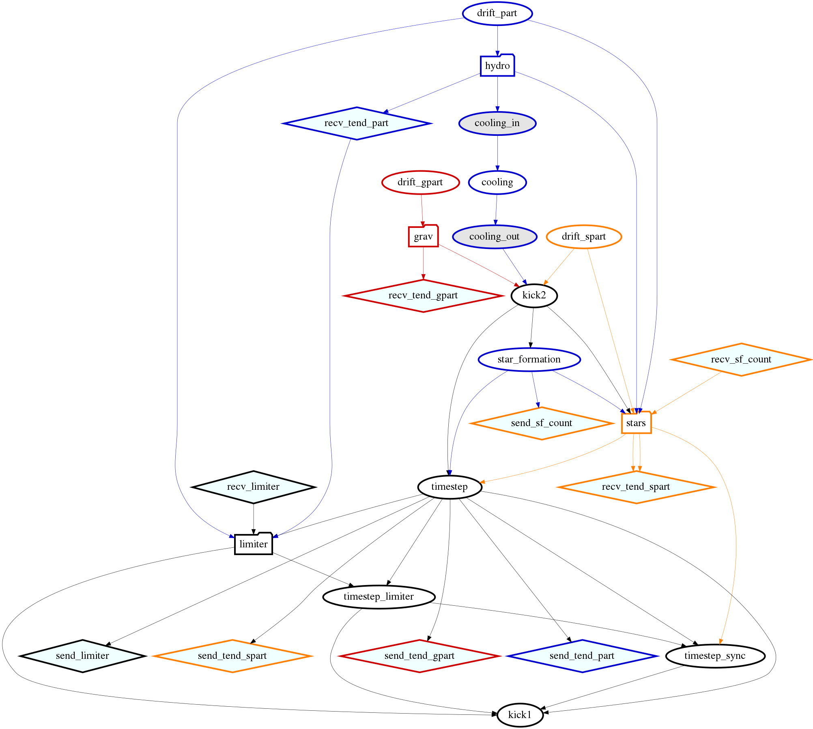
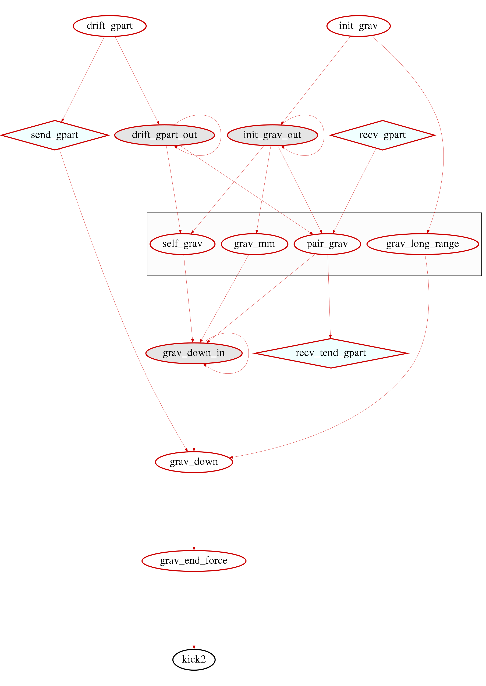
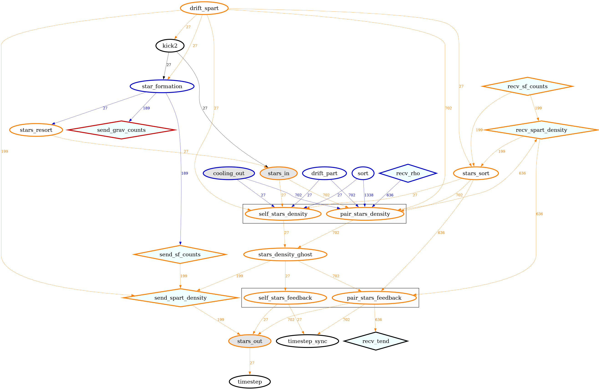

.. Current task dependencies
   Loic Hausammann, 2020

.. _current_dependencies:

Current Task Dependencies
=========================

In order to compute the physics in the correct order, SWIFT uses dependencies in between the tasks.
In :ref:`Analysis_Tools`, we describe our tool to generate a graph of the dependencies but,
unfortunately, the graphs tend to be too large.
Therefore in this section we show some smaller graphs created by hand (thus they are not necessarily reflecting an actual run depending on the physics simulated).
The task in the form of ellipses are computational tasks while the diamond are communications.
The colors are picked depending on the type of physics computed (blue for hydro, yellow for stars, red for gravity and black for the rest).
The gray tasks are implicit tasks that do not compute anything but are useful to simplify the task dependencies.
The first graph shows the full graph (without AGN and sink particles) but with some tasks collapsed into a single meta-task
(hydrodynamics, gravity and stellar feedback):

    This figure shows the task dependencies for a run with gravity, hydro, cooling, star formation and stellar feedback.
    The tasks for the limiter, hydrodynamics, stellar feedback and gravity are collapsed into a single meta-task.
    The other graphs are showing the details of the collapsed tasks except for the limiter that is done in the same way than the density loop.
    The first tasks to be executed are at the top (without any incoming links) and then follow the order of the links
    until the last tasks without any outgoing links.
    This was done with SWIFT v0.9.0.

As the hydrodynamics are described in :ref:`hydro`, we are only showing the gravity and stellar feedback here:

    This figure shows the task dependencies for the gravity.
    The rectangle represents the computation of the forces through either the direct computation or the multipole expansion.
    This was done with SWIFT v0.9.0.

    This figure shows the task dependencies for the stellar feedback.
    The first rectangle groups the tasks that compute the smoothing length of the stars and
    the second one the tasks that deposit the energy into the surrounding gas.
    This was done with SWIFT v0.9.0.
