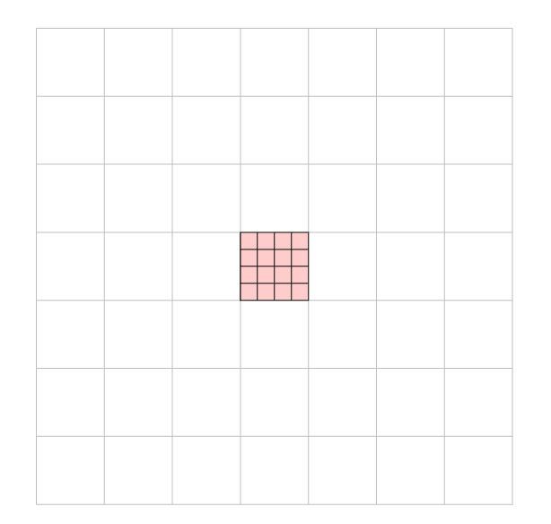
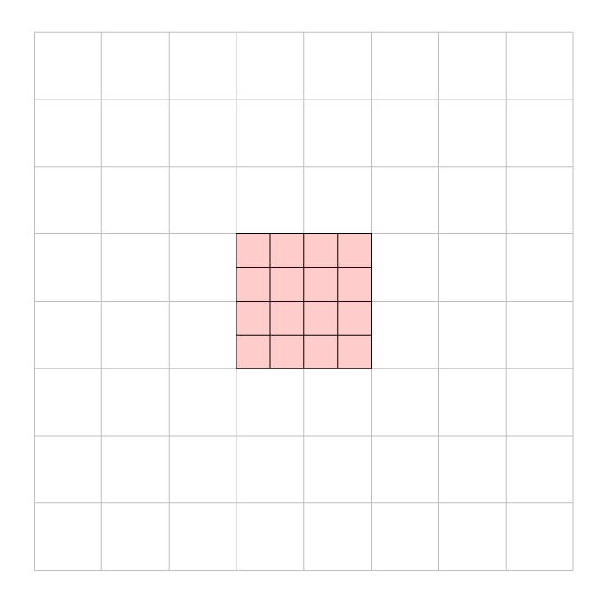
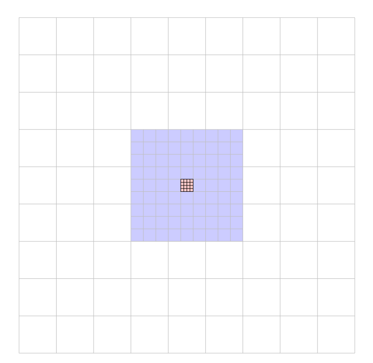

.. Zoom cell structures
   Will Roper, 14th March 2024

Cell Construction and Their Hierarchy
=====================================

At it's root SWIFT is a cartesian grid of cells holding particles, on which computations can be performed. When defining a single cartesian grid for a zoom simulation the calculation becomes inbalanced with most of the work confined to a single (or handful of) cell(s). To combat this a hierachy of cell grids is introduced to better resolve the work. That hierachy and its construction is defined here.

There are 3 approaches to cell grid construction for zoom simulations. Each of these is tailored to a specific use case depending on the size of the zoom region relative to the box. These are a necessity due to the performance constraints inherent at the ends of the range of spatial scales a zoom simulation can cover.

Intermediate Zoom Regions
-------------------------

At the intermediate scales, the zoom region must tesselate the entire box an integer number of times. A background cell is therefore the size of the zoom region and no buffer cells are employed. This is the simplest approach.

Large Zoom Regions
------------------

When the zoom region is an appreciable percentage of the volume the above simple approach fails since it can in the worst case produce a 3x3x3 cell grid. This not only leads to a very poorly resolved background but can also increase the size of the zoom region leading to a poorly resolved zoom region too.

To stop this from happening the number of zoom regions needed to tesselate the periodic box an integer number of times is found (while keeping the zoom region dimensions as close to ``ZoomRegion:region_pad_factor`` times high resolution particle extent). The number of background cells along an axis is then divided by two until it reaches the target set by ``ZoomRegion:bkg_top_level_cells`` ensuring both the zoom region and background are sufficiently well resolved for task construction.

Small Zoom Regions
------------------

For small zoom regions applying the naive approach used at intermediate spatial scales results in far too many background cells bogging down the calculation. To avoid this the number of background cells is set to `ZoomRegion:bkg_top_level_cells` exactly. The background cell/s containing the zoom region are then populated with buffer cells which bridge the gap between the background cell scale and the zoom region scale. This ensures the background isn’t resolved with pointlessly high resolution while making sure the zoom region does not need to drastically increase in size. This also has the bonus of increasing the cell resolution around the zoom region where the background resolution also increases.

Cell Construction
-----------------

In any of the methods detailed above the process of cell construction is:

1. Define zoom region geometry and background cell properties.
2. Shift particles to centre the zoom region.
3. Construct zoom, background, and (when applicable) buffer top level cell grids.
4. Recursively construct cell trees and multipoles in all top level cells.
5. (In MPI land) Communicate multipoles.
6. Construct the void cell trees out of the void cells and zoom multipoles.

Below is a general description of the important stages in the construction of the cell hierarchy.

Zoom Region Dimensions
~~~~~~~~~~~~~~~~~~~~~~

The dimensions of the zoom region are defined in ``zoom_init.zoom_region_init`` by first finding the extent of all non-background particles and then padding this extent by ``ZoomRegion:region_pad_factor`` (defined in the parameter file, by default 1.5). After this initial definition, the zoom region dimensions can be increased to ensure the background cell grid/s align (based on each method detailed above).

The number of zoom cells along an axis of the zoom region is defined by the ``ZoomRegion:zoom_top_level_cells`` parameter, while their size is calculated in ``zoom_init.zoom_region_init`` after the dimensions of the zoom region have been found. If running with hydro, only zoom cells are given hydro-related tasks.

Particle Shifting
~~~~~~~~~~~~~~~~~

Before constructing cells we shift the particle distribution to place the geometric midpoint of the high-resolution particle distribution at the centre of the box. This is done to ensure boundary effects can be ignored while constructing the cell grids and tasks.

This shift is independant of the user specified shift defined in the parameter file (``InitialConditions:shift``). The shift applied to centre the zoom region will be undone prior to writing out any positions to a snapshot. This is not true of ``InitialConditions:shift`` which will be respected and not undone.

Void Cell Tree
~~~~~~~~~~~~~~

Once the 2 (or 3 when buffer cells are included) cell grids in the hierachy have been constructed, a cell tree is constructed in all void cells. This cell tree is constructed in the same way as a “normal” cell tree is for any other cell. However, a void cell tree’s leaves are not leaves of the void cell but are instead zoom cells (which themselves contain a normal cell tree).

To avoid recursing from a void cell right through to the leaves of the zoom cell tree the parent void cells of the zoom cells are given ``c->split = 0``, while zoom cell's parents are ``NULL`` but have a new member (``void_parent``) which points to their parent void cell in the void cell tree.

This linking of zoom cells as leaves is one of the reasons the cell grids must align perfectly (although task definitions and proxies also rely on this being the case). Since the leaves must be linked in like this ``ZoomRegion:zoom_top_level_cells`` must be ``ZoomRegion:region_buffer_cell_ratio`` times a power of two.

The void cell trees allow for long-range gravity tasks involving the zoom region to be done at levels above individual zoom cells and thus limits the number of long-range gravity calculations around the zoom region. They also provide a method for limiting the number of MPI communications around the zoom region.
