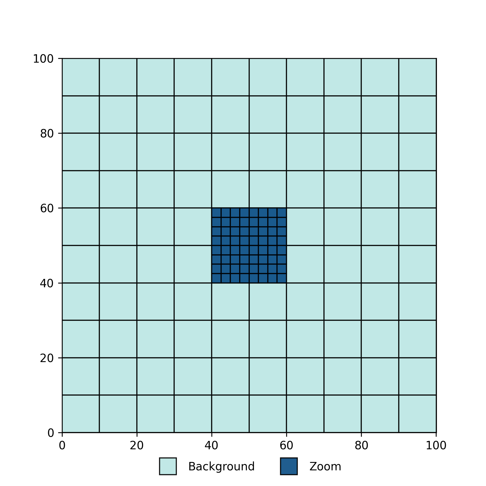
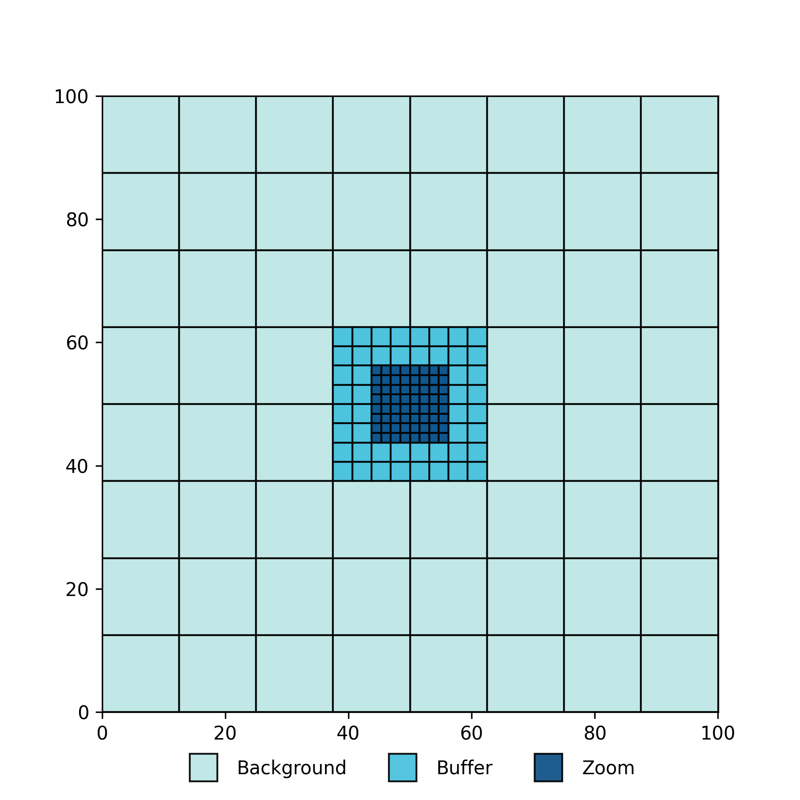

.. Zoom cell structures
   Will Roper, 20th November 2024

Cell Construction and Their Hierarchy
=====================================

SWIFT uses a Cartesian grid of cells populated with particles, which serves as the basis for performing computations. When using a single grid for a zoom simulation, the workload is by definition exceedingly imbalanced, with most of the work concentrated in a single cell or a small number of cells. To address this imbalance, we introduce a hierarchy of cell grids to distribute the workload more effectively.

There are two types of hierarchies used, depending on the zoom simulation's geometry:

   1. Two-level hierarchy: This hierarchy consists of background cells and zoom cells, where the zoom cells are nested at a certain depth inside the background cells.
   2. Three-level hierarchy: This hierarchy has background cells, buffer cells, and zoom cells. The buffer cells are nested inside the background cells, while the zoom cells are nested within the buffer cells.

The two-level hierarchy is used when the zoom region is relatively large compared to the background cells. The three-level hierarchy is employed when the zoom region is small compared to the background cells. Examples of each setup are shown below.

The choice of hierarchy is automatically made by SWIFT based on the parameters defining the zoom region geometry and the distribution of high-resolution particles. If the zoom region can align well with the background cell edges without adding excessive padding, only background cells and zoom cells are used. Buffer cells are automatically added when the padding needed to align the zoom and background cells increases the zoom region size by more than a factor of 2.

Large Zoom Regions
------------------

In this example, we have 10 background cells along each side. This allows the zoom region to align with the central 4 background cells, while increasing the zoom region size by less than a factor of 2. The 4 background cells containing the zoom region are referred to as "void" cells.

Cell Construction
~~~~~~~~~~~~~~~~~

   1. Define background cell properties based on ``ZoomRegion:bkg_top_level_cells``.
   2. Find the extent of the high resolution particle distribution and pad this extent by ``ZoomRegion:region_pad_factor``.
   3. Shift particles to centre the volume.
   4. Align the zoom region with the background cells that enclose it calculating the zoom region extent.
   5. Derive the zoom cell properties using their depth within a background cell (``ZoomRegion:zoom_top_level_depth``). The zoom cell width is then ``2**zoom_top_level_depth`` times smaller than the background cell width and the number of zoom cells along an axis is then the zoom region width divided by this width. 
   6. Construct zoom and background top level cell grids.
   7. Recursively construct cell trees and multipoles in all top level cells.
   8. (In MPI land) Communicate multipoles.
   9. Construct the void cell trees by recursing through void cells and attaching zoom cell leaves when at the zoom level (defined by ``ZoomRegion:zoom_top_level_depth``).

Small Zoom Regions
------------------

In this example, we again start with similar conditions, but now with 8 background cells along each side. This small change means that padding the zoom region would increase its size by more than a factor of 2. To address this, buffer cells are introduced between the background cells and the zoom cells, filling in the extra space. The central 4 background cells now contain these buffer cells, and are again referred to as "void" cells because they contain a nested top level cell grid. In turn, the 16 central buffer cells that contain the zoom region are also considered "void" cells since they contain the nested top level zoom cells.

Cell Construction
~~~~~~~~~~~~~~~~~

   1. Define background cell properties based on ``ZoomRegion:bkg_top_level_cells``.
   2. Find the extent of the high resolution particle distribution and pad this extent by ``ZoomRegion:region_pad_factor``.
   3. Shift particles to centre the volume.
   4. Align the buffer region with the background cells that enclose it calculating the buffer region extent.
   5. Derive the buffer cell properties using their depth within a background cell (``ZoomRegion:buffer_top_level_depth``). The buffer cell width is then ``2**zoom_top_level_depth`` times smaller than the background cell width and the number of buffer cells along an axis is then the buffer region width divided by this width.
   6. Align the zoom region with the buffer cells that enclose it calculating the zoom region extent.
   7. Derive the zoom cell properties using their depth within a background cell (``ZoomRegion:zoom_top_level_depth``). The zoom cell width is then ``2**zoom_top_level_depth`` times smaller than the background cell width and the number of zoom cells along an axis is then the zoom region width divided by this width. Note that this is why ``buffer_top_level_depth<zoom_top_level_depth``.
   8. Construct zoom, background, and buffer top level cell grids.
   9. Recursively construct cell trees and multipoles in all top level cells.
   10. (In MPI land) Communicate multipoles.
   11. Construct the void cell trees by recursing through void cells and attaching zoom and buffer cell leaves when at the corresponding level.

Zoom Region Dimensions
----------------------

The dimensions of the zoom region are defined in ``zoom_init.zoom_region_init`` by first finding the extent of all non-background particles and then padding this extent by ``ZoomRegion:region_pad_factor`` (defined in the parameter file, by default 1.5). After this initial definition, the zoom region dimensions can be increased to ensure the background (and buffer) cell grid(s) align (based on each method detailed above).

Particle Shifting
-----------------

Before constructing cells we shift the particle distribution to place the high-resolution particle distribution's centre of mass at the centre of the box. This is done to ensure boundary effects can be ignored while constructing the cell grids and tasks.

This shift is independant of the user specified shift defined in the parameter file (``InitialConditions:shift``). The shift applied to centre the zoom region will be undone prior to writing out any positions to a snapshot. This is not true of ``InitialConditions:shift`` which will be respected and not undone in outputs.

Void Cell Tree
--------------

Once the 2 (or 3 when buffer cells are included) cell grids in the hierachy have been constructed, a cell tree is constructed in all void cells. This cell tree is constructed by starting at the background top level. Each void cell is divided in half along each axis resulting in 8 child cells. We then recurse into this child level and repeat. This is the same operation used during the normal cell tree construction, the difference being that a void cell is always split, whereas the normal splitting operation would check if the particle count in the cell required splitting. We always split a void cell because we need to split until we hit the zoom (and buffer) depths. Once these depths are reached we link in the top level cells made separately as the children of the void cell.

To avoid recursing from a void cell right through to the leaves of the zoom cell tree, parent void cells with top level cell children are given ``c->split = 0``. Nested top level cell's parents are set to ``NULL`` because they don't have "true" parent containing particles. Instead, nested top level cells have a new member (``void_parent``) which points to their parent void cell in the void cell tree.

The void cell trees allow for long-range gravity and multipole-multipole tasks involving the zoom region to be done at levels above individual zoom cells and thus limits the number of gravity interactions done around the zoom region. They also provide a method for limiting the number of MPI communications around the zoom region.
