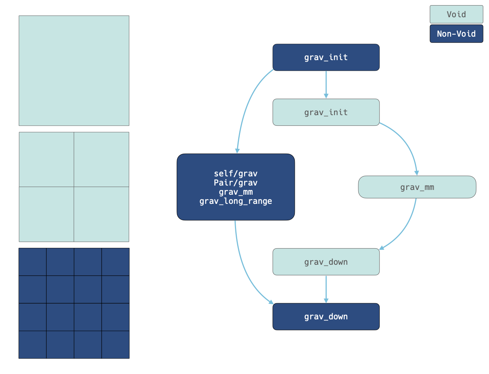

.. Zoom Gravity Task Creation
   Will Roper, 20th November 2024

Gravity Task Creation
=====================

To reduce the number of interactions between top level cells and nested top level cells we attempt to offload as many interactions as possible into multipole interactions. To achieve this we first create tasks at the highest possible level and then split these tasks checking if we can do multipole interactions as we split. 

Top Level Task Creation
-----------------------

In `zoom_maketasks` we create the initial gravity tasks for each background cell just as would be done in a uniform box. Background cells get self tasks and pair tasks, this includes void cells (the cells that contain the zoom region) which get self and pair tasks despite containing no particles. Tasks involving void cells will be split down the cell tree as described below.

Void Task Splitting
-------------------

Once all tasks are created at the top level, we begin the process of recursively splitting the tasks down the cell trees. For non-void cells we split if the number of particles involved exceeds the task thresholds defined in the ``Scheduler`` parameter section, however, tasks involving void cells must be split since they contain no particles and therefore cannot do ``self/grav`` or ``pair/grav`` tasks. They do have multipoles though, which means we can perform long range and ``grav_mm`` interactions at the void level.

As we split, we check to see if the interaction can instead be done via multipoles, in which case a much cheaper ``grav_mm`` task is made within the void cell tree. If a ``grav_mm`` task cannot be used (because the cells are too close together) then we recurse down to the next level in the void cell tree/s. Once we hit a nested top level cell with particles (i.e. a buffer or zoom cell) the task splitting switches to the normal logic based on the number of particles involved in the interaction.

When considering splitting a task we need to consider 3 separate cases:

   - For a void->void interaction we can freely split both sides of the interaction because we know there will be progeny (void cells always have 8 progeny by construction). 
   - We can split both sides of an interaction if one is a void cell and the other cell is a splittable cell. 
   - For a void to unsplittable cell interaction we must split the void cell in isolation (recall that they have no particles so cannot be left with self and pair tasks). This leads to a special case if a ``grav_mm`` task can be used where a "direct" MM task is created between the unsplittable cell and the void cell directly, rather than acting on the progeny of the pair of cells as would normally be the case.

This process guarantees we have the most chances to avoid a direct interaction and interact at the highest possible level across the zoom region boundary.

Void Tasks
----------

Void cells can only have a limited subset of tasks. Since they can't contain particles they can't have self and pair tasks (hence the explicit splitting). Void cells at the super level can have:

   - ``grav_init``: The multipoles need to be initialised for each step they are active. The zoom inits must be done before the parent void inits, otherwise its possible for void ``grav_mm`` tasks that interact nested top level cells to happen before the zoom inits have happened.
   - ``grav_mm``: Cheap multipole interactions can be done in the void tree instead of numerous direct pair interactions at the nested top level.
   - ``grav_down``: Since the multipoles can be interacted the potentials need to be propagated down to the zoom cells. The void cell ``grav_down`` will handle the propagation down to the nested super level. The nested ``grav_down`` will then handle the propagation from there.

The drifting of void cells is handled outside of the tasking prior to the call to ``engine_launch``. Similarly the collection of timestep information (``timestep_collect``) is done outside the tasking after ``engine_launch`` is called to collect the timesteps of the nested top level cells which themselves are properly updated within the tasking.

Void Task Dependencies 
~~~~~~~~~~~~~~~~~~~~~~ 

While void cells don't carry that many task types, they do introduce some complex dependency rules. These dependencies are shown in the figure below.

The left hand side shows a schematic of the cell tree in a single void cell. Here we have 2 void cell levels with a set of nested top level cells at a depth of 2. The right hand side shows a simplified view of the task dependencies between the void cells and the nested top level. The arrows denote a dependency, i.e. the arrow points from the unlocking task to the unlocked task. The lighter boxes denote void cell tasks while the darker boxes denote nested tasks (at the buffer or zoom level).

In short:

   - The nested ``grav_init`` tasks must run before all void tasks to ensure the nested multipoles are ready for any void tasks that will recurse to their level. In practice the simplest way to enforce this behaviour is to introduce a dependency between the nested init and the void init. 
   - The void ``grav_down`` must run before the nested ``grav_down`` to ensure all interactions done in the void cell tree are propagated all the way to the leaves of the nested cell tree.

