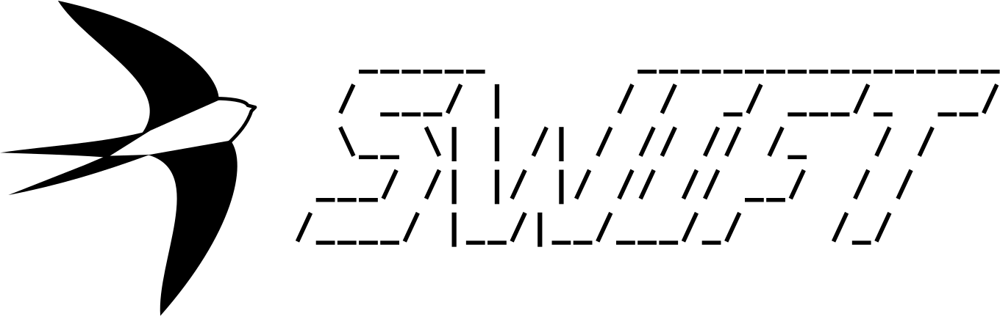

.. Welcome!
   sphinx-quickstart on Wed Apr  4 15:03:50 2018.
   You can adapt this file completely to your liking, but it should at least
   contain the root `toctree` directive.

Welcome to SWIFT: SPH With Inter-dependent Fine-grained Tasking's documentation!
================================================================================

Want to get started using SWIFT? Check out the on-boarding guide available
`here <https://swift.strw.leidenuniv.nl/onboarding.pdf>`_.

SWIFT is an open-source cosmological and astrophysical numerical
solver designed to run efficiently on modern hardware. A comprehensive
and extensive set of models for galaxy formation as well as planetary
physics are provided alongside a large series of examples.

This users' and developers' documentation is best enjoyed with a glass
of Amarone and Rachmaninoff's second piano concerto in the
background. We note that good results have also been reported using a
tumbler of 16yrs old Lagavulin.

.. toctree::
   :maxdepth: 2

   CitingSWIFT/index
   GettingStarted/index
   CommandLineOptions/index
   ParameterFiles/index
   InitialConditions/index
   Snapshots/index
   HydroSchemes/index
   TimeStepping/index
   SubgridModels/index
   Planetary/index
   FriendsOfFriends/index
   VELOCIraptorInterface/index
   LineOfSights/index
   LightCones/index
   EquationOfState/index
   ExternalPotentials/index
   Neutrinos/index
   RadiativeTransfer/index
   NewOption/index
   Task/index
   AnalysisTools/index
   CSDS/index
   ImplementationDetails/index
